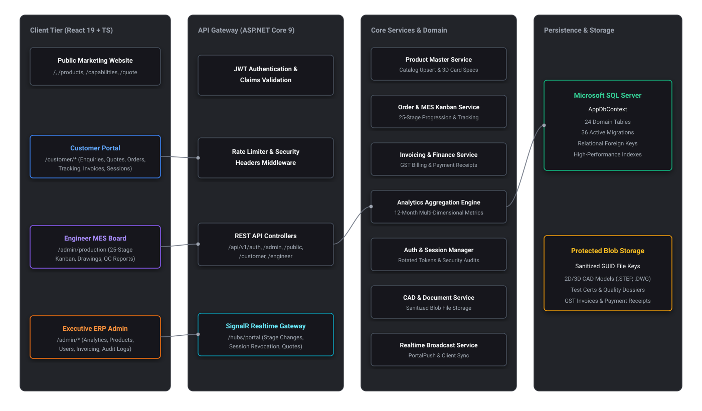
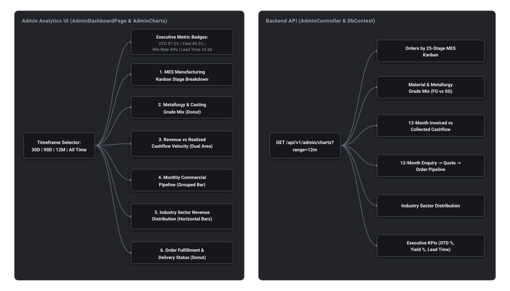
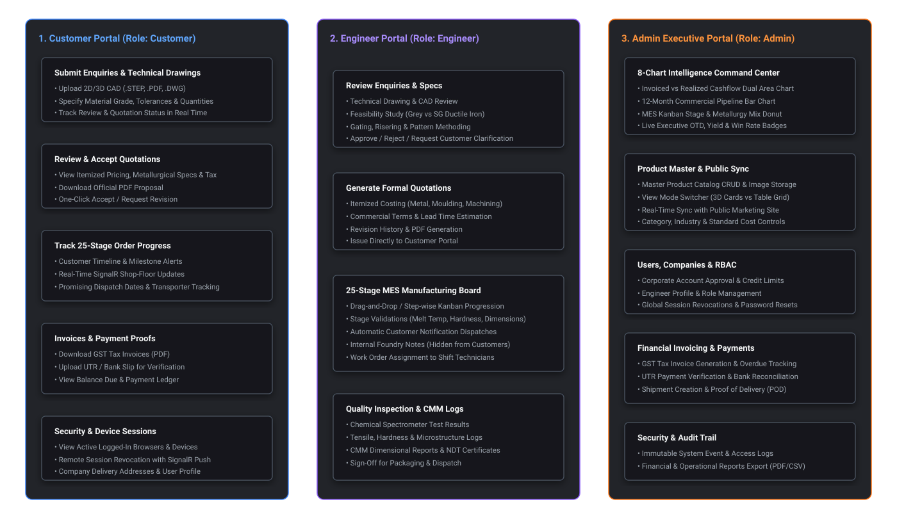
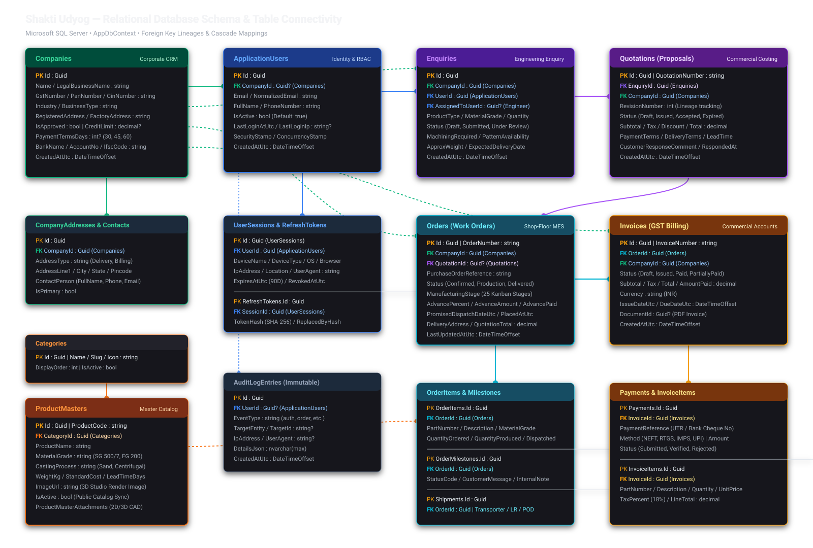
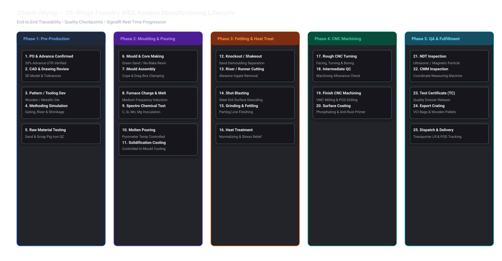

# Shakti Udyog — Complete System Architecture & Visual Data Flow

> **Classification:** High-Fidelity Visual Architecture Reference  
> **Platform Stack:** ASP.NET Core 9 | EF Core 9 | Microsoft SQL Server | React 19 | TypeScript | Vite 8 | SignalR

---

## 1. System Architecture & Component Topology

---

## 2. Operations & Financial Analytics Architecture

---

## 3. 3-Portal Data Flow & Visibility Matrix

---

## 4. Relational Database Schema & Table Structures (AppDbContext)

---

## 5. 25-Stage Foundry MES Kanban Manufacturing Lifecycle

