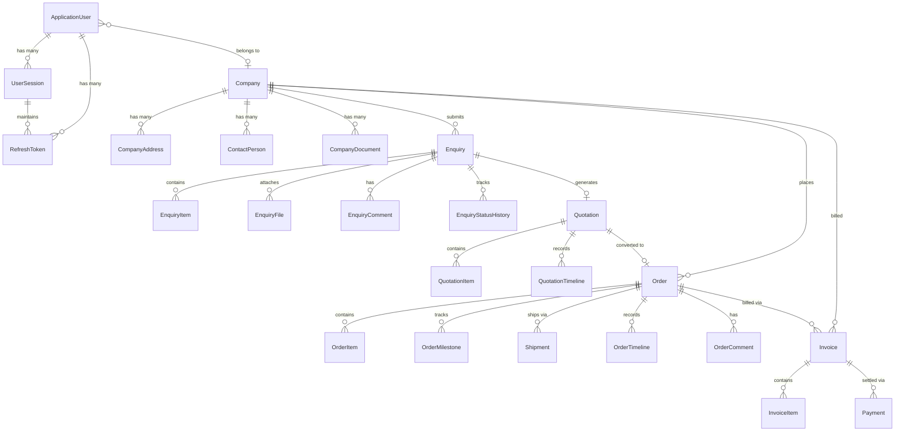
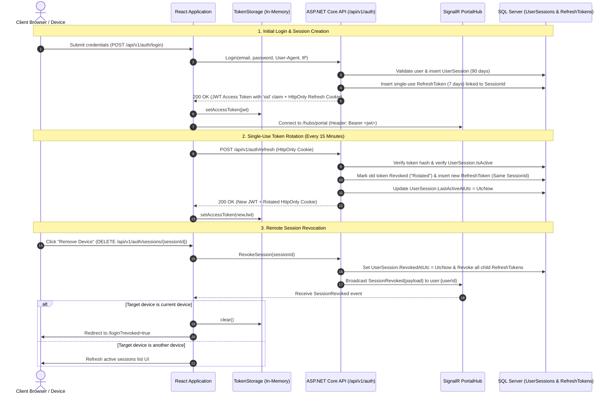

# Shakti Udyog — Complete System Architecture & Objects Overview

> **Document Version:** 1.0  
> **Classification:** Technical Architecture & Object Reference (Source of Truth)  
> **Platform Stack:** ASP.NET Core 9 (C# 13) | EF Core 9 | Microsoft SQL Server | React 19 | TypeScript | Vite 8 | TailwindCSS 4 | SignalR

---

## Table of Contents
1. [Executive Summary & System Architecture](#1-executive-summary--system-architecture)
2. [End-to-End Component Topology](#2-end-to-end-component-topology)
3. [Database Schema & Domain Entities (Object Models)](#3-database-schema--domain-entities-object-models)
4. [Data Transfer Objects (API Contracts & DTOs)](#4-data-transfer-objects-api-contracts--dtos)
5. [Frontend Architecture & Type System](#5-frontend-architecture--type-system)
6. [Real-Time SignalR Hubs & Event Payloads](#6-real-time-signalr-hubs--event-payloads)
7. [Security, Session & Token Lifecycle](#7-security-session--token-lifecycle)
8. [ERP Manufacturing Workflow & Stage State Machine](#8-erp-manufacturing-workflow--stage-state-machine)

---

## 1. Executive Summary & System Architecture

**Shakti Udyog** is an enterprise-grade, multi-tier industrial manufacturing ERP and customer portal for high-precision sand casting, centrifugal casting, and CNC machining operations.

The system connects three primary stakeholder groups in real time:
1. **B2B Industrial Customers:** Submit queries/enquiries, track multi-stage manufacturing progress, approve drawings, inspect test certificates, download invoices, and manage company accounts.
2. **Operations & Plant Engineers:** Manage a 25-stage Kanban production board, review engineering specifications, generate detailed line-item quotations, assign work orders, and log quality inspection results.
3. **Executive & ERP Administrators:** Oversee company accounts, user roles, financial invoicing, commercial deal closures, system configuration, security audit logs, and operational reports.

```mermaid
graph TD
    subgraph Client Tier (React 19 + TypeScript SPA)
        PublicWeb["Public Marketing Website<br/>(/, /products, /capabilities)"]
        CustomerPortal["Customer Portal<br/>(/customer/*)"]
        EngineerBoard["Engineer 25-Stage Board<br/>(/admin/production, /admin/enquiries)"]
        AdminPortal["Executive ERP Admin<br/>(/admin/*)"]
    end

    subgraph API & Realtime Gateway (ASP.NET Core 9)
        AuthMiddleware["JWT Authentication & Claims Validation"]
        RateLimiter["Rate Limiting & Security Headers"]
        Controllers["REST API Controllers (/api/v1/*)"]
        SignalRHub["SignalR PortalHub (/hubs/portal)"]
    end

    subgraph Business & Infrastructure Services
        AuthService["Auth & Session Service"]
        TokenService["Token & Session Manager"]
        PortalPush["Real-Time Push Service"]
        FileService["Storage & Validation Service"]
        AuditService["Security Audit Logger"]
    end

    subgraph Persistence & Storage Tier
        SQLServer[("Microsoft SQL Server<br/>(AppDbContext - 36 Migrations)")]
        BlobStorage[("Local File / Blob Storage<br/>(Sanitized GUID Keys)")]
    end

    ClientTier -->|HTTPS REST| AuthMiddleware
    ClientTier -->|WSS WebSockets| SignalRHub
    AuthMiddleware --> RateLimiter
    RateLimiter --> Controllers
    Controllers --> BusinessServices
    SignalRHub --> PortalPush
    BusinessServices --> SQLServer
    BusinessServices --> BlobStorage
```

---

## 2. End-to-End Component Topology

### 2.1 Backend Project Structure
- **`ShaktiUdyog.Domain`**: Core domain entities, business models, and enums. Has zero external dependencies.
- **`ShaktiUdyog.Infrastructure`**: EF Core database contexts, identity configuration, token services, User-Agent parser, file storage provider, and database migrations.
- **`ShaktiUdyog.Api`**: REST API controllers, SignalR hubs, authentication handlers, request/response contracts, background services, and middleware.
- **`ShaktiUdyog.Api.Tests`**: Automated integration and unit test suite (xUnit, WebApplicationFactory, 66+ passing test cases).

### 2.2 Frontend Project Structure
- **`src/types/`**: Centralized Domain Type System (single source of truth for all domain entities, DTOs, enums, and API contracts).
- **`src/api/`**: Strongly-typed HTTP client (`client.ts`) with automatic in-memory Bearer token injection, silent 401 retry, and endpoint clients.
- **`src/auth/`**: Authentication state (`AuthContext`), token storage (in-memory closures), role definitions, and route guards (`ProtectedRoute`).
- **`src/components/ui/`**: Glacier design system components (`Button`, `Badge`, `Card`, `Modal`, `EmptyState`, `Section`, `Breadcrumb`, `Loading`).
- **`src/hooks/`**: Reusable custom hooks (`useDebounce`, `usePagination`, `useAsync`, `useRealtimeEvent`).
- **`src/utils/`**: Shared formatters (`formatCurrency`, `formatDate`, `formatRelativeTime`, `formatFileSize`) and validators (`isValidEmail`, `isValidGst`, `isValidPan`).
- **`src/realtime/`**: SignalR connection singleton, typed event handlers, and window event bridge.
- **`src/portal/` & `src/pages/`**: Role-guarded customer, admin, and engineer portal pages and public marketing website.

---

## 3. Database Schema & Domain Entities (Object Models)

Below is the complete catalog of EF Core domain entities defined in `ShaktiUdyog.Domain.Entities`.



### 3.1 Security & Session Management Entities

#### `ApplicationUser` (inherits `IdentityUser<Guid>`)
Represents an authenticated user across Customer, Engineer, and Admin roles.
- `Id: Guid` (PK)
- `Email: string`, `NormalizedEmail: string`
- `UserName: string`, `NormalizedUserName: string`
- `FullName: string`
- `PhoneNumber: string?`
- `CompanyName: string?`
- `CompanyId: Guid?` (FK $\to$ `Company.Id`)
- `IsActive: boolean` (Default: `true`)
- `CreatedAtUtc: DateTimeOffset`
- `LastLoginAtUtc: DateTimeOffset?`
- `LastLoginIp: string?`
- `SecurityStamp: string`
- `ConcurrencyStamp: string`

#### `UserSession`
Represents a persistent physical device session.
- `Id: Guid` (PK)
- `UserId: Guid` (FK $\to$ `ApplicationUser.Id`)
- `DeviceName: string` (e.g., "Chrome on Windows", "Safari on iPhone")
- `DeviceType: string` ("Desktop", "Mobile", "Tablet", "Unknown")
- `OperatingSystem: string` (e.g., "Windows", "macOS", "iOS", "Android", "Linux")
- `Browser: string` (e.g., "Chrome", "Firefox", "Edge", "Safari")
- `UserAgent: string?` (Max 500 chars)
- `IpAddress: string?` (Max 50 chars)
- `Location: string?` (Max 150 chars, e.g. "Mumbai, India", "Local Network")
- `CreatedAtUtc: DateTimeOffset`
- `LastActiveAtUtc: DateTimeOffset`
- `ExpiresAtUtc: DateTimeOffset` (90 days validity)
- `RevokedAtUtc: DateTimeOffset?`
- `RevocationReason: string?`
- `IsActive: boolean` (Calculated: `RevokedAtUtc == null && ExpiresAtUtc > DateTimeOffset.UtcNow`)

#### `RefreshToken`
Decoupled single-use cryptographic token associated with a persistent `UserSession`.
- `Id: Guid` (PK)
- `UserId: Guid` (FK $\to$ `ApplicationUser.Id`)
- `SessionId: Guid?` (FK $\to$ `UserSession.Id`, `DeleteBehavior.Restrict`)
- `TokenHash: string` (SHA-256 hash of raw cryptographic token)
- `CreatedAtUtc: DateTimeOffset`
- `ExpiresAtUtc: DateTimeOffset` (7 days validity)
- `CreatedByIp: string?`
- `RevokedAtUtc: DateTimeOffset?`
- `RevokedByIp: string?`
- `RevocationReason: string?`
- `ReplacedByTokenHash: string?` (Token family lineage for theft detection)

#### `AuditLogEntry`
Immutable audit trail for compliance, security events, and administrative actions.
- `Id: Guid` (PK)
- `EventType: string` (e.g. "auth.login.success", "order.stage.updated", "auth.session.revoked")
- `UserId: Guid?` (Actor user ID)
- `TargetEntity: string?` (e.g. "Order", "UserSession", "Quotation")
- `TargetId: string?`
- `IpAddress: string?`
- `UserAgent: string?`
- `DetailsJson: string?` (Structured event metadata)
- `CreatedAtUtc: DateTimeOffset`

---

### 3.2 Corporate Account Entities

#### `Company`
B2B customer organization profile.
- `Id: Guid` (PK)
- `Name: string`
- `LegalBusinessName: string?`
- `BusinessType: string?` (e.g. "Private Limited", "Partnership", "Public Limited")
- `Industry: string?` (e.g. "Automotive", "Pumps & Valves", "Power Generation")
- `Website: string?`
- `CompanyEmail: string?`, `CompanyPhone: string?`
- `PurchaseEmail: string?`, `AccountsEmail: string?`
- `RegisteredAddress: string?`, `FactoryAddress: string?`
- `City: string?`, `State: string?`, `PostalCode: string?`, `Country: string?`
- `GstNumber: string?`, `PanNumber: string?`, `TanNumber: string?`, `CinNumber: string?`, `MsmeNumber: string?`
- `BankName: string?`, `BankAccountNumber: string?`, `BankIfscCode: string?`, `BankBranch: string?`
- `IsApproved: boolean`
- `ApprovedAtUtc: DateTimeOffset?`
- `CreditLimit: decimal?`
- `PaymentTermsDays: int?` (e.g. 30, 45, 60 days)
- `CreatedAtUtc: DateTimeOffset`

#### `CompanyAddress`
Multiple delivery and billing destinations per corporate account.
- `Id: Guid` (PK)
- `CompanyId: Guid` (FK $\to$ `Company.Id`)
- `AddressType: string` ("Delivery", "Billing", "Warehouse")
- `AddressLine1: string`, `AddressLine2: string?`
- `City: string`, `State: string`, `PostalCode: string`, `Country: string`
- `IsPrimary: boolean`
- `CreatedAtUtc: DateTimeOffset`

#### `ContactPerson`
Authorized procurement and engineering personnel.
- `Id: Guid` (PK)
- `CompanyId: Guid` (FK $\to$ `Company.Id`)
- `FullName: string`
- `Designation: string?`
- `Department: string?`
- `Email: string`
- `Phone: string`
- `IsPrimary: boolean`
- `CreatedAtUtc: DateTimeOffset`

---

### 3.3 Sales, Query & Quotation Entities

#### `Enquiry` (Query)
Customer Query with engineering attributes.
- `Id: Guid` (PK)
- `CompanyId: Guid` (FK $\to$ `Company.Id`)
- `UserId: Guid` (FK $\to$ `ApplicationUser.Id`)
- `ProductType: string` (e.g. "Grey Iron Casting", "SG Iron / Ductile Iron", "Centrifugal Liner")
- `MaterialGrade: string?` (e.g. "FG 260", "EN-GJL-250", "EN-GJS-500-7")
- `Quantity: string`
- `DeliveryLocation: string?`
- `RequirementDetails: string`
- `Status: string` ("Draft", "Submitted", "Under Review", "Quoted", "Closed", "Archived")
- `Priority: string` ("Normal", "Urgent", "Critical")
- `IsDraft: boolean`
- `AssignedToUserId: Guid?` (FK $\to$ `ApplicationUser.Id` - Operations Engineer)
- `PartName: string?`, `PartNumber: string?`
- `Industry: string?`, `Application: string?`, `MaterialStandard: string?`
- `ApproxWeight: decimal?` (in kg)
- `MachiningRequired: string?` ("Raw / Unmachined", "Rough Machined", "Finish Machined to Drawing")
- `PatternAvailability: string?` ("New Pattern Required", "Existing Pattern Available", "Pattern Modification Needed")
- `PrototypeQuantity: string?`, `ProductionQuantity: string?`, `AnnualRequirement: string?`
- `ExpectedDeliveryDate: DateTimeOffset?`
- `PreferredDeliveryTerms: string?` (e.g. "Ex-Works", "FOB", "CIF", "Door Delivery")
- `AdditionalRequirements: string?`, `Remarks: string?`
- `CreatedAtUtc: DateTimeOffset`

#### `EnquiryFile`
Secure drawings, 3D CAD models, and technical specifications attached to an Enquiry/Query.
- `Id: Guid` (PK)
- `EnquiryId: Guid` (FK $\to$ `Enquiry.Id`)
- `FileName: string`
- `ContentType: string` (e.g. "application/pdf", "image/png", "model/step")
- `SizeBytes: long`
- `StorageKey: string` (Sanitized GUID filepath on disk/cloud)
- `UploadedByUserId: Guid?`
- `UploadedAtUtc: DateTimeOffset`

#### `Quotation`
Formal commercial and engineering proposal.
- `Id: Guid` (PK)
- `QuotationNumber: string` (e.g. "QT-2026-0042")
- `RevisionNumber: int` (Default: `1`)
- `EnquiryId: Guid` (FK $\to$ `Enquiry.Id`)
- `CompanyId: Guid` (FK $\to$ `Company.Id`)
- `Status: string` ("Draft", "Pending Approval", "Issued", "Accepted", "Rejected", "Expired", "Cancelled")
- `Subtotal: decimal`, `Tax: decimal`, `Discount: decimal`, `Total: decimal`
- `Currency: string` (Default: "INR")
- `ValidUntilUtc: DateTimeOffset?`
- `PaymentTerms: string?` (e.g. "30% Advance, 70% against PI / Dispatch")
- `DeliveryTerms: string?`, `DeliveryTime: string?` (e.g. "4-6 Weeks from Pattern Approval")
- `Warranty: string?`, `Freight: string?`, `Packing: string?`, `Remarks: string?`
- `CustomerResponseComment: string?`
- `CustomerRespondedAtUtc: DateTimeOffset?`
- `DocumentId: Guid?`
- `CreatedAtUtc: DateTimeOffset`

#### `QuotationItem`
Line-item costing breakdown.
- `Id: Guid` (PK)
- `QuotationId: Guid` (FK $\to$ `Quotation.Id`)
- `LineNumber: int`
- `PartNumber: string`, `Description: string`
- `MaterialGrade: string?`
- `Quantity: decimal`
- `Unit: string` (e.g. "Nos", "Kg", "Sets")
- `UnitPrice: decimal`
- `TaxPercent: decimal` (e.g. 18.00)
- `LineTotal: decimal`

---

### 3.4 Production, Orders & Logistics Entities

#### `Order`
Confirmed manufacturing purchase order.
- `Id: Guid` (PK)
- `OrderNumber: string` (e.g. "SO-2026-0108")
- `PurchaseOrderReference: string?` (Customer PO reference)
- `QuotationId: Guid?` (FK $\to$ `Quotation.Id`)
- `CompanyId: Guid` (FK $\to$ `Company.Id`)
- `Status: string` ("Draft", "Placed", "Advance Pending", "In Production", "QC Inspection", "Ready for Dispatch", "Dispatched", "Delivered", "Completed", "Cancelled")
- `ManufacturingStage: string` (One of the 25 Kanban stage codes)
- `PlacedAtUtc: DateTimeOffset`
- `PromisedDispatchDateUtc: DateTimeOffset?`
- `DeliveryAddress: string?`
- `AssignedToUserId: Guid?` (Operations Engineer in charge)
- `LastUpdatedAtUtc: DateTimeOffset`

#### `OrderItem`
Specific items manufactured in this work order.
- `Id: Guid` (PK)
- `OrderId: Guid` (FK $\to$ `Order.Id`)
- `PartNumber: string`, `Description: string`
- `MaterialGrade: string?`
- `DrawingRevision: string?`
- `Unit: string`
- `QuantityOrdered: decimal`
- `QuantityProduced: decimal`
- `QuantityDispatched: decimal`

#### `Shipment`
Dispatch tracking, freight vehicle details, and Proof of Delivery (POD).
- `Id: Guid` (PK)
- `OrderId: Guid` (FK $\to$ `Order.Id`)
- `Transporter: string?` (e.g. "VRL Logistics", "TCI Express", "Blue Dart")
- `TrackingNumber: string?` (LR / AWB / Docket number)
- `VehicleNumber: string?` (e.g. "MH-12-AB-1234")
- `PhoneNumber: string?` (Driver / Transporter contact)
- `DispatchDateUtc: DateTimeOffset?`
- `EstimatedArrivalUtc: DateTimeOffset?`
- `DeliveredAtUtc: DateTimeOffset?`
- `HasProofOfDelivery: boolean`

---

### 3.5 Billing, Finance & Payments Entities

#### `Invoice`
Commercial GST Tax Invoice generated against fulfilled orders.
- `Id: Guid` (PK)
- `InvoiceNumber: string` (e.g. "INV-2026-0089")
- `OrderId: Guid` (FK $\to$ `Order.Id`)
- `CompanyId: Guid` (FK $\to$ `Company.Id`)
- `Status: string` ("Draft", "Issued", "Partially Paid", "Paid", "Overdue", "Cancelled")
- `Subtotal: decimal`, `Tax: decimal`, `Total: decimal`, `AmountPaid: decimal`, `BalanceDue: decimal`
- `Currency: string` ("INR")
- `IssueDateUtc: DateTimeOffset`
- `DueDateUtc: DateTimeOffset?`
- `DocumentId: Guid?`
- `CreatedAtUtc: DateTimeOffset`

#### `Payment`
Payment transaction records and verification status.
- `Id: Guid` (PK)
- `InvoiceId: Guid` (FK $\to$ `Invoice.Id`)
- `PaymentReference: string` (UTR / Bank Transaction ID / Cheque No)
- `Method: string` ("NEFT", "RTGS", "IMPS", "UPI", "Cheque", "Letter of Credit")
- `Amount: decimal`
- `PaymentDateUtc: DateTimeOffset`
- `Status: string` ("Submitted", "Verified", "Rejected")
- `CreatedAtUtc: DateTimeOffset`

---

## 4. Data Transfer Objects (API Contracts & DTOs)

All API contracts adhere to standardized, camelCase JSON serializations.

### 4.1 Authentication & Session Contracts
```typescript
interface LoginRequest {
  email: string;
  password?: string;
  rememberMe?: boolean;
}

interface AuthResponse {
  accessToken: string;
  expiresAtUtc: string;
  refreshToken?: string;
  user?: AuthUser;
}

interface UserSessionDto {
  id: string;
  deviceName: string;
  deviceType: string;
  operatingSystem: string;
  browser: string;
  ipAddress: string | null;
  location: string | null;
  createdAtUtc: string;
  lastActiveAtUtc: string;
  expiresAtUtc: string;
  isCurrent: boolean;
}

interface SessionRevokedPayload {
  sessionId: string;
  reason: string;
  revokedAtUtc: string;
  message?: string;
}
```

### 4.2 Generic Pagination Contract
```typescript
interface Paged<T> {
  items: T[];
  page: number;
  pageSize: number;
  totalCount: number;
}
```

---

## 5. Frontend Architecture & Type System

The frontend code structure is strictly modularized across centralized domains:

```
frontend/src/
├── api/                  # Unified API Client & Service endpoints
│   ├── client.ts         # Core fetch wrapper with auto-auth & silent 401 retry
│   ├── publicApi.ts      # Public catalog & marketing form endpoints
│   ├── customerApi.ts    # Authenticated customer portal endpoints
│   ├── engineerApi.ts    # Engineering board & operations endpoints
│   ├── adminApi.ts       # Executive admin ERP management endpoints
│   └── index.ts          # Central API barrel export
├── types/                # Central Domain Type System
│   ├── common.ts         # Paged, ApiResponse, DateRange, FilterParams
│   ├── auth.ts           # AuthUser, UserSession, SessionRevokedPayload, RoleType
│   ├── company.ts        # CompanyDetail, CompanyAddress, ContactPerson, Profile
│   ├── enquiry.ts        # EnquiryListItem, EnquiryDetail, EnquiryFile, Timeline
│   ├── quotation.ts      # QuotationListItem, QuotationDetail, QuotationItem
│   ├── order.ts          # OrderListItem, OrderDetail, OrderItem, Shipment
│   ├── invoice.ts        # InvoiceListItem, InvoiceDetail, Payment
│   ├── catalog.ts        # AdminProduct, AdminCategory, AdminIndustry, DocumentItem
│   ├── production.ts     # Dashboard, EngineerDashboard, ProductionStageInfo
│   └── index.ts          # Master barrel export
├── components/           # UI Components & Design System
│   ├── ui/               # Glacier primitives (Button, Badge, Card, Modal, EmptyState)
│   ├── dashboard/        # Dashboard cards, counters, and metrics
│   ├── sidebar/          # Responsive navigation sidebar
│   └── PublicLayout.tsx  # Marketing website layout shell
├── hooks/                # Reusable React Hooks
│   ├── useDebounce.ts    # Search input debouncing
│   ├── usePagination.ts  # Pagination state manager
│   ├── useAsync.ts       # Async operation lifecycle wrapper
│   ├── useRealtimeEvent.ts# SignalR custom window event subscriber
│   └── index.ts          # Hooks barrel export
├── utils/                # Standard Formatters & Validators
│   ├── formatters.ts     # Currency (₹), dates, relative time, file sizes
│   ├── validators.ts     # Email, phone, GSTIN, PAN, password strength
│   ├── download.ts       # Blob file downloader
│   └── index.ts          # Utils barrel export
├── realtime/             # SignalR WebSockets Singleton
│   └── signalR.ts        # Hub connection, automatic reconnection, and push listeners
└── auth/                 # Authentication Context & Storage
    ├── AuthContext.tsx   # React Auth state provider
    ├── tokenStorage.ts   # Secure in-memory token closures (no storage tokens)
    └── ProtectedRoute.tsx# Role-based route guard
```

---

## 6. Real-Time SignalR Hubs & Event Payloads

### 6.1 Hub Endpoint: `/hubs/portal`
- Transport: WebSockets with Server-Sent Events (SSE) and Long Polling fallbacks.
- User Grouping: Connected authenticated users are automatically enrolled into `user:{userId}` and relevant `order:{orderId}` groups.

### 6.2 Broadcast Events
| Event Name | Recipient Group | Description |
| :--- | :--- | :--- |
| `SessionRevoked` | `user:{userId}` | Emitted immediately when an active session is remotely revoked. |
| `OrderStageChanged` | `order:{orderId}` | Emitted when an order transitions across any of the 25 manufacturing stages. |
| `QuotationIssued` | `user:{userId}` | Emitted when an engineer issues a new quotation revision. |
| `InvoiceGenerated` | `user:{userId}` | Emitted when a billing invoice is generated. |
| `NotificationReceived` | `user:{userId}` | Emitted on alerts, reminders, and system messages. |

---

## 7. Security, Session & Token Lifecycle



---

## 8. ERP Manufacturing Workflow & Stage State Machine

Every casting order progresses through 25 discrete shop-floor stages categorized into 5 sequential phases:

```mermaid
stateDiagram-v2
    [*] --> PRE_PROD_1: Order Placed & PO Verified

    state "Phase 1: Pre-Production & Engineering" as Phase1 {
        PRE_PROD_1: 1. PO Verification & Advance Confirmed
        PRE_PROD_2: 2. Engineering Drawing Review & 3D CAD
        PRE_PROD_3: 3. Pattern / Die Tooling Development
        PRE_PROD_4: 4. Methoding, Gating & Riser Simulation
        PRE_PROD_5: 5. Raw Material & Sand Quality Inspection
    }

    state "Phase 2: Moulding, Melting & Pouring" as Phase2 {
        CAST_1: 6. Mould Preparation & Core Making
        CAST_2: 7. Mould Assembly & Closing
        CAST_3: 8. Induction Furnace Charge & Melting
        CAST_4: 9. Spectrometer Chemical Composition Testing
        CAST_5: 10. Temperature Measurement & Pouring
        CAST_6: 11. Controlled Cooling & Solidification
    }

    state "Phase 3: Fettling, Cleaning & Heat Treatment" as Phase3 {
        FINISH_1: 12. Knockout & Shakeout
        FINISH_2: 13. Riser, Runner & Ingate Cutting
        FINISH_3: 14. Shot Blasting & Surface Cleaning
        FINISH_4: 15. Grinding & Fettling
        FINISH_5: 16. Heat Treatment & Normalizing / Annealing
    }

    state "Phase 4: Machining & Precision Operations" as Phase4 {
        POST_1: 17. Rough CNC Machining
        POST_2: 18. Intermediate Dimensional Inspection
        POST_3: 19. Finish CNC Machining & Boring
        POST_4: 20. Surface Treatment / Phosphating / Painting
    }

    state "Phase 5: Quality Assurance, Packing & Fulfillment" as Phase5 {
        FULFILL_1: 21. Non-Destructive Testing (NDT / UT / MPI / DP)
        FULFILL_2: 22. Final CMM Dimensional & Visual Inspection
        FULFILL_3: 23. Test Certificate (TC) & Quality Dossier Generation
        FULFILL_4: 24. Anti-Rust Coating, Packing & Wooden Crating
        FULFILL_5: 25. Dispatch, Transporter Booking & Delivery
    }

    PRE_PROD_1 --> PRE_PROD_2
    PRE_PROD_2 --> PRE_PROD_3
    PRE_PROD_3 --> PRE_PROD_4
    PRE_PROD_4 --> PRE_PROD_5
    PRE_PROD_5 --> CAST_1
    CAST_1 --> CAST_2
    CAST_2 --> CAST_3
    CAST_3 --> CAST_4
    CAST_4 --> CAST_5
    CAST_5 --> CAST_6
    CAST_6 --> FINISH_1
    FINISH_1 --> FINISH_2
    FINISH_2 --> FINISH_3
    FINISH_3 --> FINISH_4
    FINISH_4 --> FINISH_5
    FINISH_5 --> POST_1
    POST_1 --> POST_2
    POST_2 --> POST_3
    POST_3 --> POST_4
    POST_4 --> FULFILL_1
    FULFILL_1 --> FULFILL_2
    FULFILL_2 --> FULFILL_3
    FULFILL_3 --> FULFILL_4
    FULFILL_4 --> FULFILL_5
    FULFILL_5 --> [*]: Order Fulfilled & Closed
```


