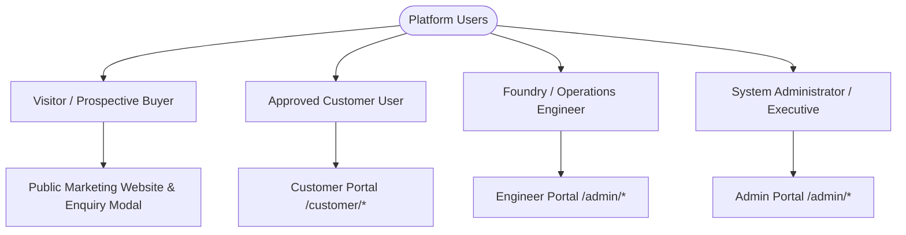
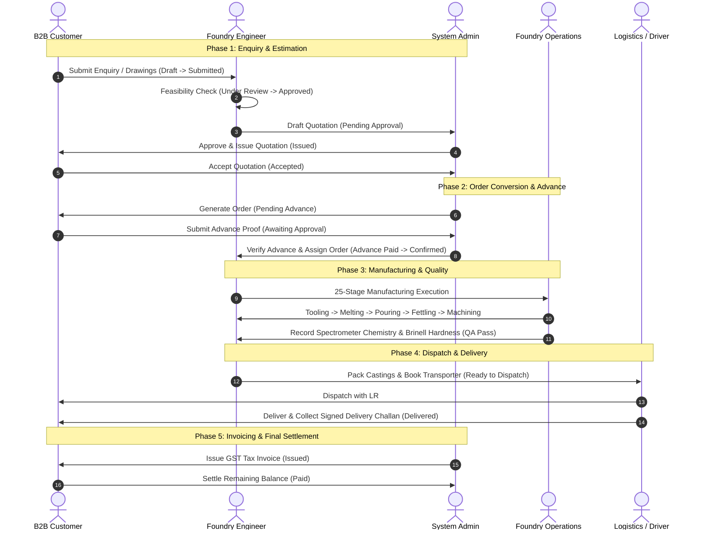
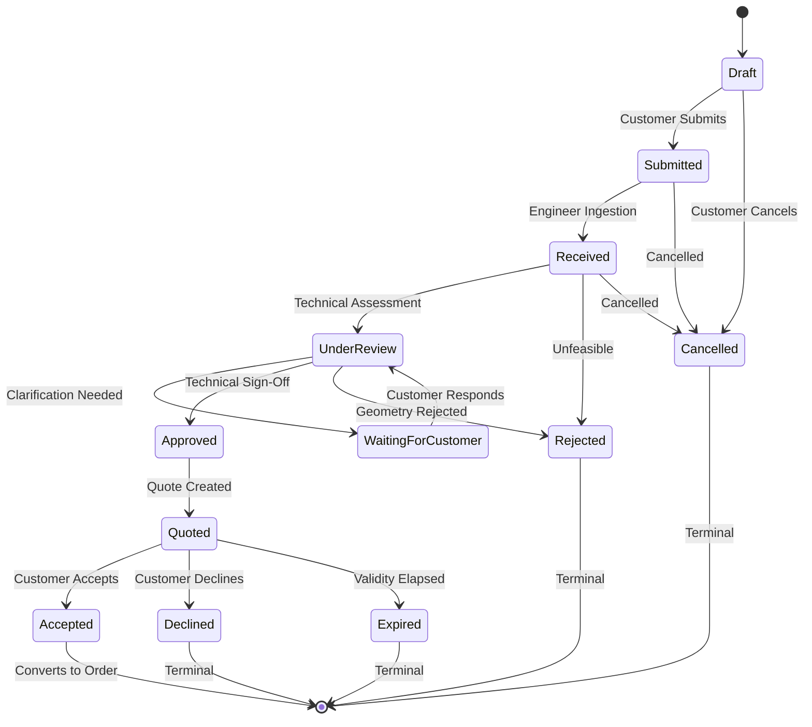
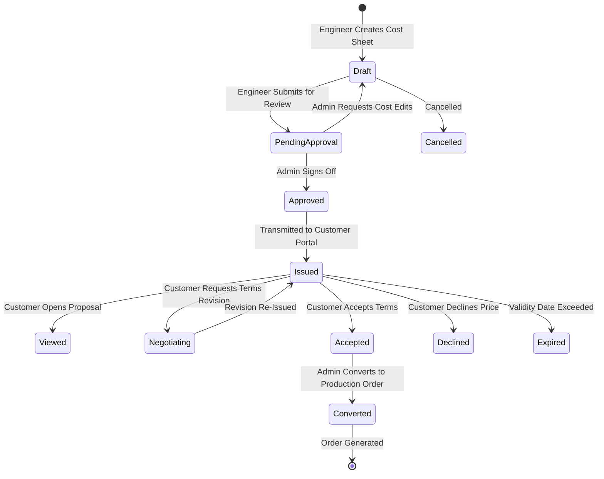
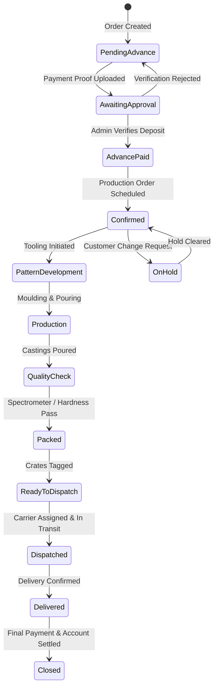

# Shakti Udyog — Product Requirements Document (PRD)

> **Document Version:** 2.0  
> **Status:** Active / Source of Truth  
> **Last Updated:** August 2026  
> **Target Audience:** Engineering, Product, Operations, Executive Leadership, LLM Agents  

---

## 1. Executive Summary & Business Overview

### 1.1 Company Profile
* **Company Legal Name:** Shakti Udyog
* **Founding Year:** 1965 (60+ years of industrial casting excellence)
* **Headquarters & Foundry Location:** St No. 5, Daba Road, near SPS Hospital, Ludhiana, Punjab 141013, India
* **GST Number:** `03**********1Z0`
* **Contact Details:** Phone: `+91 8043848014` | WhatsApp: `+91 8283041140` | Email: `iamrahulbhola@gmail.com`
* **Operating Scale:**
  * Monthly Melting & Casting Capacity: **299 Metric Tons**
  * Material Specifications & Grades: **50+ Iron Casting Grades**
  * Historical Customer Base: **9,000+ Customers Served** across industrial OEMs and Tier-1 suppliers

### 1.2 Core Product Portfolio
1. **Grey Iron Castings (IS 210 / EN 1561 / ASTM A48 equivalents):**
   - High damping capacity, superior machinability, wear resistance.
   - Applications: Machine tool beds, gear housings, pump and valve bodies, flywheels, bearing housings.
2. **Ductile / Spheroidal Graphite (SG) Iron Castings (IS 1865 / EN 1563 / ASTM A536 equivalents):**
   - High tensile strength, impact toughness, ductility for dynamic loads.
   - Applications: Axle carriers, differential cases, suspension brackets, heavy machinery hubs, high-pressure hydraulic components.
3. **Custom / OEM Castings:**
   - 2D drawings and 3D CAD step/stp model assessment, rapid pattern tooling, bespoke metallurgical chemistry.
4. **Value-Added Machining & Surface Finishing:**
   - Shot blasting (SA 2.5 standard), CNC/VMC precision machining, drilling, tapping, rust-preventive primer/paint coatings, export-grade protective packaging.

### 1.3 Target Industries Served
* Automotive & Commercial Transportation
* Agricultural Equipment & Tractor Assemblies
* Fluid Handling (Pumps, Valves, Compressors)
* Machine Tools & Industrial Machinery
* Heavy Earthmoving & Construction Equipment
* Power Transmission & Infrastructure Systems
* Rail & Metro Transport Systems

---

## 2. Strategic Objectives & Product Vision

### 2.1 Product Vision
To establish a modern, transparent, and enterprise-grade digital casting platform that bridges prospective industrial buyers, approved B2B corporate customers, foundry operations engineers, and executive management.

### 2.2 Core Product Objectives
* **Streamline Customer Procurement:** Reduce quotation turnaround time from days to hours through structured Enquiry ingestion, automated drawing storage, and real-time approval tracking.
* **Eliminate Order Black Boxes:** Deliver an Amazon-grade order tracking experience adapted for industrial manufacturing—from pattern design through metal pouring, shakeout, fettling, inspection, and dispatch.
* **Empower Foundry Floor Execution:** Provide real-time Kanban visualization of active orders and jobs across 25 granular manufacturing stages with forward-only state progression.
* **Institutionalize Compliance & Auditability:** Enforce server-side multi-tenant data isolation, immutable audit logging for all business transactions, and end-to-end commercial transparency (invoices, advances, credit notes).

---

## 3. User Personas & Portal Architecture

### 3.1 Visitor / Prospective Buyer
* **Context:** Unauthenticated industrial purchasing managers, engineers seeking quotes.
* **Key Tasks:** Browse verified casting capabilities, inspect alloy grades, submit contact enquiries, submit Enquiries with CAD/PDF drawings.
* **Experience Requirements:** High-impact visual storytelling, low-friction Enquiry submission, honeypot spam protection.

### 3.2 Registered Customer (B2B Client)
* **Context:** Authenticated purchasing and supply chain personnel representing verified customer companies.
* **Key Tasks:** Submit detailed multi-item Enquiries, review and accept/negotiate quotations, track confirmed order timelines, submit advance payment receipts, stream official documents (MTCs, invoices, dispatch challans), raise order-linked support requests.
* **Experience Requirements:** Multi-company context, zero exposure to internal shop-floor cost notes, transparent status notifications.

### 3.3 Operations / Foundry Engineer
* **Context:** Internal shop-floor supervisors, estimation engineers, and quality inspectors.
* **Key Tasks:** Review incoming enquiries, prepare cost breakdown and quotation line items, manage assigned order milestones, update 25-stage manufacturing progress, record quality test results (chemical/dimensional/NDT), upload dispatch documents and carrier details.
* **Experience Requirements:** Workload filtering (assigned orders only), drag-and-drop Kanban interface, quick stage transition actions.

### 3.4 System Administrator & Executive
* **Context:** Managing Directors, Plant Heads, Commercial Finance Officers.
* **Key Tasks:** Manage user roles and company authorizations, approve and issue customer quotations, assign orders to engineers, verify offline payments, generate tax invoices, govern master data (products, alloys, prices), view audit trails and export executive analytics.
* **Experience Requirements:** Global visibility across all entities, deal financial settlement oversight, PDF/CSV/Excel reporting exports.

---

## 4. End-to-End Functional Requirements

### 4.1 Module 1: Public Marketing & Enquiry Submissions
* **FR-1.1 Navigation & Static Content:** Deliver responsive public pages for Home, About Us, Products, Capabilities, Quality & Lab Standards, Industries, Technical Resources, Contact Us, and Legal Policies.
* **FR-1.2 Dynamic Catalog & Alloy Directory:** Publicly queryable product hierarchy with slug-based routing, alloy specifications, physical properties, and typical engineering applications.
* **FR-1.3 Public Enquiry Form:** Submits contact requests with honeypot validation (`website` anti-bot trap) returning immediate confirmation.
* **FR-1.4 Public Enquiry Submission:** Allows multi-file drawing uploads (`.pdf`, `.dwg`, `.dxf`, `.step`, `.stp`, `.zip`), part geometry details, target volumes, and delivery location without mandatory pre-registration.

### 4.2 Module 2: Enquiry Management
* **FR-2.1 Customer Enquiry Creation:** Authenticated customers can save drafts, attach multiple line items, upload revision drawings, and submit to the engineering queue.
* **FR-2.2 Draft & Edit Lifecycle:** Draft enquiries remain fully mutable by the customer; once submitted, fields lock to prevent alteration during estimation review.
* **FR-2.3 Technical Assessment:** Engineers evaluate casting feasibility, pattern tooling requirements, weight estimates, alloy grade availability, and machining allowances.
* **FR-2.4 Enquiry Status Flow:**
  $$\text{Draft} \longrightarrow \text{Submitted} \longrightarrow \text{Received} \longrightarrow \text{Under Review} \longrightarrow \text{Approved} \longrightarrow \text{Quoted} \longrightarrow \text{Accepted} / \text{Declined} / \text{Cancelled}$$

### 4.3 Module 3: Quotation Estimation & Commercials
* **FR-3.1 Quotation Drafting:** Engineers construct itemized quotations with unit casting price, tooling/pattern costs, machining rates, applicable GST, delivery timelines, and warranty terms.
* **FR-3.2 Admin Approval Workflow:** Quotations created by engineers enter `Pending Approval` and require Admin review before being formally `Issued` to the client.
* **FR-3.3 Customer Response:** Customers review line items and commercial terms with direct actions: **Accept**, **Decline**, or **Request Revision (Negotiating)** with recorded notes.
* **FR-3.4 Versioning & Revisions:** Quotation revisions track previous totals, incremental changes, and revision author audit trails.

### 4.4 Module 4: Order Management & Fulfilment
* **FR-4.1 Order Conversion:** Confirmed acceptance of a quotation triggers Admin order generation, applying commercial terms (e.g., 30% advance deposit).
* **FR-4.2 Engineer Assignment:** Admins assign each order to a dedicated foundry engineer (`Order.AssignedToUserId`). Engineers hold execution rights exclusively over their assigned workload.
* **FR-4.3 Customer-Facing Order Timeline:** Amazon-style milestone progression:
  1. `Order Confirmed`
  2. `Pattern / Tooling in Progress`
  3. `In Production`
  4. `Quality Inspection`
  5. `Packed`
  6. `Ready to Dispatch`
  7. `Dispatched`
  8. `Delivered`
* **FR-4.4 Shipment & Logistics Management:** Records transporter name, vehicle registration number, driver contact phone, LR/tracking number, dispatch timestamp, estimated arrival, and Proof of Delivery (POD) document.

### 4.5 Module 5: 25-Stage Manufacturing Kanban
* **FR-5.1 Granular Shop-Floor Stages:**
  1. *New Enquiries* $\to$ 2. *Engineering Review* $\to$ 3. *Quotation Sent* $\to$ 4. *Customer Approval* $\to$ 5. *Order Confirmed* $\to$ 6. *Pattern Design* $\to$ 7. *Pattern Making* $\to$ 8. *Material Planning* $\to$ 9. *Raw Material Ready* $\to$ 10. *Core Making* $\to$ 11. *Moulding* $\to$ 12. *Furnace Charging* $\to$ 13. *Melting* $\to$ 14. *Pouring* $\to$ 15. *Cooling* $\to$ 16. *Shakeout* $\to$ 17. *Fettling* $\to$ 18. *Shot Blasting* $\to$ 19. *Machining* $\to$ 20. *Heat Treatment* $\to$ 21. *Surface Finishing* $\to$ 22. *Quality Inspection* $\to$ 23. *Packing* $\to$ 24. *Ready for Dispatch* $\to$ 25. *Dispatched*.
* **FR-5.2 Forward-Only Progression:** Prevents out-of-sequence movement across manufacturing stages; validates job preconditions.
* **FR-5.3 Quality Inspections:** Records chemical spectrometer readings, Brinell hardness test scores, ultrasonic NDT results, accepted vs. rejected counts, and inspector sign-offs.

### 4.6 Module 6: Invoices & Payment Reconciliation
* **FR-6.1 Tax Invoicing:** Admin invoice generation calculating HSN/SAC codes, subtotal, CGST/SGST/IGST, line discounts, and payment terms against confirmed orders.
* **FR-6.2 Offline Payment Proofs:** Customers submit bank transfer (NEFT/RTGS/UPI) transaction reference numbers and payment receipts. Admins review and verify payment to unlock subsequent production or dispatch stages.
* **FR-6.3 Credit & Debit Notes:** Issued for balance adjustments, defect rejections, or commercial reconciliations without altering immutable issued invoices.
* **FR-6.4 External Ingest Webhook:** Secure webhook receiver (`POST /api/v1/integrations/invoice-webhook`) for incoming ERP/accounting system synchronizations.

### 4.7 Module 7: Secure Document Management
* **FR-7.1 Category Tagging:** Standardized categories: `Inspection Report`, `Invoice`, `Packing List`, `Material Test Certificate (MTC)`, `Delivery Challan`, `Part Drawing`.
* **FR-7.2 Private Storage:** Zero public directory exposure. Binary assets stream through authenticated API endpoints (`GET /api/v1/customer/documents/{id}/download`) after company authorization validation.

### 4.8 Module 8: Executive Reporting & Exports
* **FR-8.1 Real-Time Dashboards:** KPI metric cards (Total Revenue, Active Enquiries, In-Production Tonnes, Overdue Invoices, Delivery On-Time Rate).
* **FR-8.2 Export Formats:** On-demand generation of QuestPDF reports and streaming CSV/Excel data exports for Order Pipeline, Revenue Reconciliation, and Shop-Floor Throughput.

---

## 5. Business Workflows & Entity State Machines

### 5.1 End-to-End Master Procurement Workflow

---

### 5.2 Enquiry State Machine & Transition Rules

Stored as standardized string constants in [`backend/src/ShaktiUdyog.Domain/Constants/Statuses.cs`](file:///d:/Projects/Shakti%20Udyog/backend/src/ShaktiUdyog.Domain/Constants/Statuses.cs).

| Source Status | Allowed Target Statuses | Triggering Actor / Event |
| :--- | :--- | :--- |
| `Draft` | `Submitted`, `Cancelled` | Customer completes multi-item requirements or abandons draft. |
| `Submitted` | `Received`, `Cancelled` | System / Engineer opens inbound Enquiry. |
| `Received` | `Under Review`, `Rejected`, `Cancelled` | Engineer starts technical feasibility study or flags uncastable geometry. |
| `Under Review` | `Waiting for Customer`, `Approved`, `Rejected`, `Cancelled` | Engineer requests drawing revisions, approves casting feasibility, or declines. |
| `Waiting for Customer` | `Under Review`, `Rejected`, `Cancelled` | Customer supplies revised drawings or clarifications. |
| `Approved` | `Quoted`, `Cancelled` | Estimation cost sheet drafted and quotation generated. |
| `Quoted` | `Accepted`, `Declined`, `Expired`, `Cancelled` | Customer reviews issued quotation or validity timestamp expires. |
| `Accepted` | *None (Terminal)* | System transitions Enquiry to Confirmed Order pipeline. |
| `Rejected`, `Declined`, `Expired`, `Cancelled` | *None (Terminal)* | Terminal states with immutable history log. |

---

### 5.3 Quotation State Machine & Commercial Workflow

| Quotation Status | Description | Actionable By |
| :--- | :--- | :--- |
| `Draft` | Initial calculation of raw iron rate, machining allowance, and pattern tooling. | Engineer |
| `Pending Approval` | Submitted to Admin for margin and credit term review. | Admin |
| `Approved` | Commercial terms verified; ready for customer issuance. | Admin |
| `Issued` | Transmitted to customer portal with active acceptance controls. | Customer |
| `Viewed` | Read receipt acknowledged via portal. | Customer |
| `Negotiating` | Customer requested quantity discounts or delivery adjustments. | Engineer / Admin |
| `Accepted` | Customer confirmed commercial proposal. Unlocks Order conversion. | Admin |
| `Converted` | Formally converted into active manufacturing `Order`. | System |
| `Declined` / `Expired` / `Cancelled` | Terminal closed states. | System |

---

### 5.4 Order Status Lifecycle & Customer-Facing Milestones

The order tracking experience separates **11 sequential milestones** from exception and completion states.

#### Ordered Customer Milestones Mapping

| Database Key | Customer Portal Label | Customer Description & Purpose |
| :--- | :--- | :--- |
| `pending_advance` | *Awaiting Advance Payment* | Advance deposit (e.g. 30%) required to commence pattern/material procurement. |
| `awaiting_approval` | *Payment Under Review* | Bank transfer transaction reference (NEFT/RTGS/UPI) uploaded; awaiting admin verification. |
| `advance_paid` | *Advance Confirmed* | Payment verified by accounts; order queued for production planning. |
| `confirmed` | *Order Confirmed* | Order schedule locked; bill of materials allocated. |
| `pattern_development`| *Pattern / Tooling in Progress*| 2D/3D CAD pattern tooling and match plate fabrication underway. |
| `production` | *In Production* | Active moulding, furnace melting, pouring, cooling, and fettling. |
| `quality_check` | *Quality Inspection* | Metallurgical spectrometer chemistry, tensile, Brinell hardness, and NDT checks. |
| `packed` | *Packed* | Castings shot blasted, primed, and packed in export wooden crates/pallets. |
| `ready_to_dispatch` | *Ready to Dispatch* | Weight verified, delivery challan generated, awaiting transporter pickup. |
| `dispatched` | *Dispatched* | In transit with transporter name, vehicle registration #, and driver contact phone. |
| `delivered` | *Delivered* | Consignment delivered; signed physical/digital Proof of Delivery (POD) received. |
| `on_hold` | *Action Required* | Temporarily paused pending customer drawing change or commercial clarification. |
| `cancelled` / `returned` / `closed` | *Terminal State* | Order archived or closed following full financial settlement. |

---

### 5.5 25-Stage Manufacturing Kanban Pipeline

Foundry floor execution follows a strict **forward-only** progression model across 25 sequential operations:

| # | Stage Name | Department | Core Activity & Quality Gates |
| :---: | :--- | :--- | :--- |
| **01** | *New Enquiries* | Sales & Estimation | Inbound requirements intake |
| **02** | *Engineering Review* | Engineering | Part volume, draft angles, feeder & riser simulation |
| **03** | *Quotation Sent* | Commercial | Price quotation released |
| **04** | *Customer Approval* | Customer | Customer commercial acceptance |
| **05** | *Order Confirmed* | Planning | Production planning & scheduling |
| **06** | *Pattern Design* | Pattern Shop | CAD/CAM gating design & shrinkage allowance calculation |
| **07** | *Pattern Making* | Pattern Shop | Wood/metal pattern & core box manufacturing |
| **08** | *Material Planning* | Metallurgy | Charge calculation: Pig iron, steel scrap, ferrosilicon |
| **09** | *Raw Material Ready* | Yard | Chemical inspection of raw inputs |
| **10** | *Core Making* | Core Shop | Resin/CO2 sand core shooting and baking |
| **11** | *Moulding* | Moulding | Green sand / no-bake mould preparation and box closing |
| **12** | *Furnace Charging* | Melting | Medium frequency induction furnace raw charging |
| **13** | *Melting* | Melting | Superheating iron to $1450^\circ\text{C}-1500^\circ\text{C}$ with spectrometer sample |
| **14** | *Pouring* | Pouring | Inoculation and ladle pouring into moulds |
| **15** | *Cooling* | Foundry Floor | Controlled in-mould metallurgical cooling |
| **16** | *Shakeout* | Shakeout | Vibratory mould knockout and sand separation |
| **17** | *Fettling* | Fettling | Riser, gate cut-off, and parting line grinding |
| **18** | *Shot Blasting* | Surface Prep | Heavy shot blasting to SA 2.5 cleanliness standard |
| **19** | *Machining* | Machine Shop | CNC/VMC turning, boring, milling, drilling, tapping |
| **20** | *Heat Treatment* | Metallurgy | Stress relieving / normalizing / annealing (if required) |
| **21** | *Surface Finishing* | Finishing | Rust preventive oil or primer coating application |
| **22** | *Quality Inspection* | QA Lab | Dimensional CMM inspection, Brinell hardness, NDT tests |
| **23** | *Packing* | Dispatch | Corrosion-proof VCI wrapping and wooden crating |
| **24** | *Ready for Dispatch* | Logistics | Delivery challan generation & weighbridge gross tare check |
| **25** | *Dispatched* | Logistics | Truck loading, LR # issuance, and gate pass release |

---

### 5.6 Invoicing & Payment Reconciliation Lifecycle

* **Tax Invoice States:** `Draft` $\longrightarrow$ `Issued` $\longrightarrow$ `Partially Paid` $\longrightarrow$ `Paid` (or `Overdue`, `Cancelled`, `Credit Note Issued`).
* **Payment States:** `Pending Verification` $\longrightarrow$ `Verified` (settles invoice balance) or `Rejected` (returns notice to customer).
* **Credit Notes / Debit Notes:** Issued against specific invoice line items without modifying the immutable original tax invoice record.

---

## 6. Non-Functional Requirements (NFR)

| Domain | Requirement | Target Metric |
| :--- | :--- | :--- |
| **Performance** | API response time for p95 requests | $< 200\text{ ms}$ |
| **Realtime Sync** | SignalR board update broadcast latency | $< 50\text{ ms}$ |
| **Availability** | Platform uptime SLA | $99.9\%$ during industrial shift hours (6 AM - 11 PM IST) |
| **Scalability** | Database connection pooling & query execution | Support 5,000+ concurrent active portal sessions |
| **Security** | Access Token Expiry | 15 Minutes (In-Memory only) |
| **Security** | Refresh Token Expiry | 7 Days (Rotated, Hashed SHA-256 in DB, HttpOnly Cookie) |
| **Responsiveness** | Mobile usability | 100% responsive; ERP tables collapse to mobile cards below 900px |
| **Auditability** | Data tampering prevention | 100% immutable `AuditLogs` table protected at DbContext level |

---

## 7. Success Metrics & Key Performance Indicators

1. **Quotation Turnaround Time (TAT):** Reduction of Enquiry-to-issued quote from 72 hours to $\le 12$ hours.
2. **Customer Self-Service Adoption:** $> 85\%$ of regular customers tracking orders and downloading documents via customer portal rather than telephone/WhatsApp.
3. **Dispatch Delivery Accuracy:** $100\%$ tracking of vehicle number, driver contact, and digital POD attached prior to invoice closing.
4. **Zero Cross-Company Data Leaks:** Strict zero-tolerance compliance verified through automated integration test suites.

