# Shakti Udyog — Technical Architecture Document (TAD)

> **Document Version:** 2.0  
> **Status:** Active / Source of Truth  
> **Last Updated:** August 2026  
> **Target Audience:** Solution Architects, Backend Engineers, Full-Stack Developers, DevOps  

---

## 1. System Overview & Architecture Paradigm

The **Shakti Udyog Platform** is engineered following **Clean Architecture (Onion Architecture)** principles on the backend combined with a modular, responsive **Single Page Application (SPA)** on the frontend. Data access is decoupled via the **Repository Pattern** and **Unit of Work**, and the composition root is organized through modular **Dependency Injection (DI)** extension methods.

```mermaid
graph TB
    subgraph Client Layer
        SPA[React 19 + TypeScript + Vite 8 SPA]
        Mobile[Mobile & Tablet Browsers]
        SPA --- Mobile
    end

    subgraph Presentation & Gateway Layer (ShaktiUdyog.Api)
        API[17 REST API Controllers]
        SignalR[SignalR Real-Time Hub /hubs/portal]
        AuthMW[JWT Bearer & Rate Limiting Middleware]
        Swagger[Swagger / OpenAPI Documentation]
        DIExt[Modular ServiceCollection Extensions]
        
        API --- AuthMW
        API --- SignalR
        API --- Swagger
        DIExt -.configures.-> API
    end

    subgraph Application & Domain Core (ShaktiUdyog.Domain & ShaktiUdyog.Api)
        Services[27 Application Services]
        Domain[60 POCO Domain Entities & State Machines]
        RepoInterfaces[IRepository&lt;T&gt;, IUnitOfWork & Domain Repo Interfaces]
        AuthPolicies[Dynamic Permission Policy Engine]
        
        API --> Services
        Services --> RepoInterfaces
        Services --> Domain
        Services --> AuthPolicies
    end

    subgraph Infrastructure & Persistence Layer (ShaktiUdyog.Infrastructure)
        UoWImpl[UnitOfWork & Generic Repository&lt;T&gt;]
        SpecializedRepos[Specialized EF Core Repositories]
        EFCore[EF Core 9 AppDbContext & Migrations]
        SQL[(Microsoft SQL Server)]
        Storage[Private Local / Cloud Object Storage]
        AuditEngine[Immutable Audit Log Engine]
        
        UoWImpl -.implements.-> RepoInterfaces
        SpecializedRepos -.implements.-> RepoInterfaces
        UoWImpl --> EFCore
        SpecializedRepos --> EFCore
        EFCore --> SQL
        Services --> Storage
        EFCore --> AuditEngine
    end

    ClientLayer --> GatewayLayer
    GatewayLayer --> ApplicationCore
```

---

## 2. Technology Stack & Specifications

| Layer | Framework / Technology | Version | Purpose |
| :--- | :--- | :--- | :--- |
| **Backend Runtime** | .NET SDK / ASP.NET Core | 9.0+ | Core Web API framework, high-throughput asynchronous execution |
| **Data Access & UoW** | Repository Pattern + UnitOfWork | Custom | Decoupled data persistence, transaction boundary management |
| **ORM / Data Access** | Entity Framework Core | 9.0+ | Code-first migrations, LINQ provider, connection pooling |
| **Database** | Microsoft SQL Server | 2019+ | Relational enterprise database, ACID compliance |
| **Realtime Messaging** | Microsoft.AspNetCore.SignalR | 9.0+ | Low-latency WebSockets for production Kanban & milestone updates |
| **PDF Generation** | QuestPDF / SkiaSharp | 2024+ | Programmatic generation of vector PDF quotations, MTCs, and invoices |
| **Frontend Framework**| React | 19.2+ | Component-driven declarative user interface |
| **Language** | TypeScript | 5.5+ / 6.0+ | Strict type safety across all frontend and backend models |
| **Build & Tooling** | Vite | 8.1+ | Ultra-fast HMR and optimized production bundling |
| **Styling & Theme** | TailwindCSS + Vanilla CSS | 4.3+ | "Glacier" glassmorphism theme, CSS variables, utility tokens |
| **Icons & Charts** | Lucide React + Recharts | Latest | Dashboard metrics, pipeline charts, and icon system |
| **Routing** | React Router DOM | 7.1+ | Client-side routing with role-based `ProtectedRoute` guards |

---

## 3. Backend Architecture & Solution Structure

```
backend/
├── ShaktiUdyog.sln
├── src/
│   ├── ShaktiUdyog.Domain/           # Core domain layer (Zero external dependencies)
│   │   ├── Entities/                 # 60 POCO entities (Company, Order, Quotation, Enquiry, ProductionJob, etc.)
│   │   ├── Constants/                # Roles, Permissions, Statuses, AuthPolicies, ProductionStages
│   │   └── Interfaces/               # Generic & specialized repository contracts, IUnitOfWork
│   │       ├── IRepository.cs        # Generic CRUD & query interface
│   │       ├── IUnitOfWork.cs        # Transaction coordinator & repository container
│   │       └── Repositories/         # IEnquiryRepository, IQuotationRepository, IOrderRepository, etc.
│   │
│   ├── ShaktiUdyog.Infrastructure/   # Persistence, Repositories, Identity & Migrations
│   │   ├── Repositories/             # Repository<T>, UnitOfWork, and Specialized EF Core implementations
│   │   ├── Data/                     # AppDbContext, 35 EF Core migrations, Seeders
│   │   ├── Auth/                     # TokenService, PasswordReset, OAuth Handlers
│   │   ├── Auditing/                 # AuditWriter (Enforces log immutability)
│   │   ├── Storage/                  # LocalFileStorageService (Private file stream handler)
│   │   ├── Notifications/            # PortalPushService & SignalR publisher
│   │   └── DependencyInjection.cs    # AddInfrastructure service collection extension
│   │
│   └── ShaktiUdyog.Api/              # Presentation layer (HTTP Endpoints & DI Setup)
│       ├── Controllers/              # 17 REST controllers (Customer, Admin, Engineer, Quotation, etc.)
│       ├── Services/                 # 27 Application business services (CustomerService, OrderAdminService, etc.)
│       ├── Contracts/                # C# record DTOs (Request / Response)
│       ├── Hubs/                     # SignalR Hub (PortalHub.cs)
│       ├── Authorization/            # PermissionPolicyProvider & AuthorizationHandler
│       ├── Validation/               # FluentValidation request validators
│       ├── Infrastructure/           # GlobalExceptionHandler, SwaggerSetup, DependencyInjection.cs
│       └── Program.cs                # Modular composition root & middleware pipeline
│
└── tests/
    └── ShaktiUdyog.Api.Tests/        # xUnit Integration and unit test suite (34 automated tests)
```

### 3.1 Repository Pattern & Unit of Work Architecture

The backend implements the **Repository Pattern** and **Unit of Work** to decouple application service logic from direct EF Core `AppDbContext` dependencies, ensure consistent transaction management, and simplify unit testing.

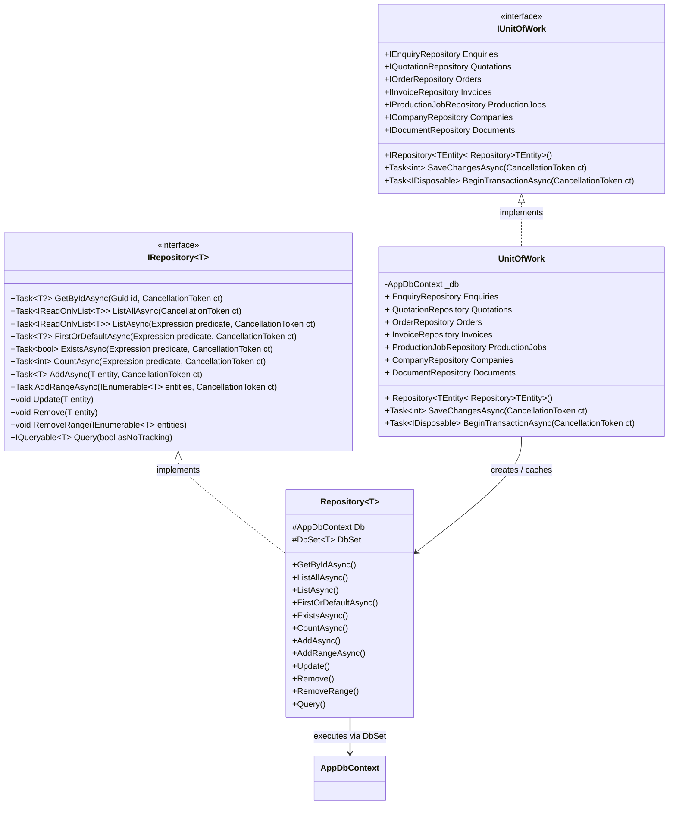

### 3.2 Modular Dependency Injection Pipeline

The application setup in `Program.cs` is composed using clean, modular extension methods grouped by responsibility:

```mermaid
flowchart LR
    Builder[WebApplication.CreateBuilder] --> AddInfra[AddInfrastructure<br/>DbContext, Repositories, UoW, Storage, Auditing]
    AddInfra --> AddId[AddIdentityInfrastructure<br/>ASP.NET Core Identity & Role Stores]
    AddId --> AddApps[AddApplicationServices<br/>27 Application Services & Realtime Push]
    AddApps --> AddJwt[AddJwtAuthentication<br/>JWT Bearer, Google & Apple OAuth]
    AddJwt --> AddAuth[AddSecurityAuthorization<br/>Dynamic Permission Policy Engine]
    AddAuth --> AddRate[AddApiRateLimiting<br/>Per-IP Security Limiters]
    AddRate --> AddPres[AddApiPresentation<br/>Controllers, SignalR, Swagger, CORS, Health]
    AddPres --> AppBuild[WebApplication.Build]
    AppBuild --> Pipeline[Middleware Pipeline & DB Migration]
```

### 3.3 Data Request Execution Lifecycle

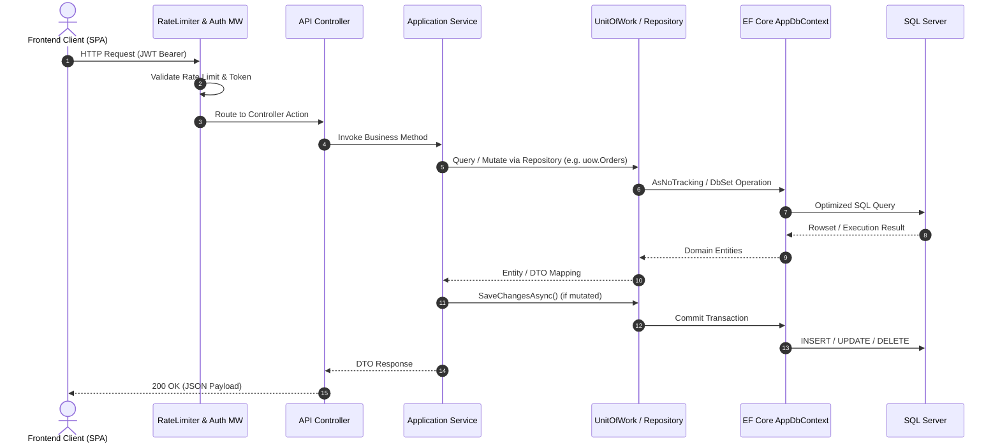

### 3.4 Automated Background Workers (`IHostedService`)

The backend registers automated hosted services via `AddHostedService<T>()` to execute scheduled maintenance, lifecycle state transitions, and asynchronous operations without blocking client HTTP threads.

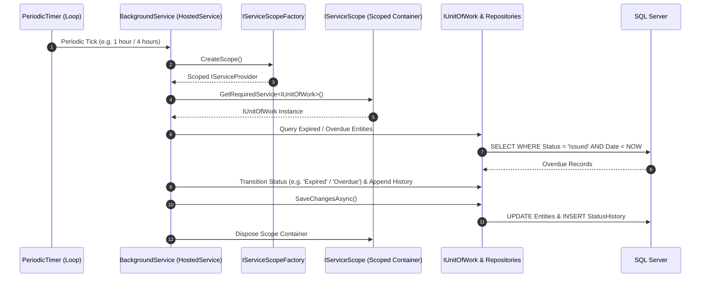

| Background Worker | Scan Interval | Trigger Condition & State Transition |
| :--- | :--- | :--- |
| **`QuotationExpirationWorker`** | Every 1 hour | Queries quotations where `Status == 'Issued'` and `ValidUntilUtc < UtcNow`. Transitions status to `Expired` and logs audit transition to `QuotationStatusHistory`. |
| **`InvoiceOverdueWorker`** | Every 4 hours | Queries invoices where `(Status == 'Issued' \|\| Status == 'Partially Paid')` and `DueDateUtc < UtcNow`. Transitions status to `Overdue` and records timeline history. |
| **`EmailSmsQueueDispatcherWorker`** | Every 30 seconds | Asynchronously drains queued/unread system notifications, broadcasting real-time SignalR push payloads (`IPortalPush`) and triggering external emails (`IEmailSender`) without blocking API client requests. |
| **`CadFileCleanupWorker`** | Every 12 hours | Scans and purges orphaned temporary CAD drawings (`.dwg`, `.step`, `.pdf`) and unsubmitted draft enquiry attachments older than 24 hours from private storage (`IFileStorageService`) and database. |
| **`ShopFloorSlaAlertWorker`** | Every 30 minutes | Monitors the 25-stage manufacturing Kanban board for production jobs exceeding target dispatch dates or delayed in bottleneck stages. Flags `IsBlocked`, adds `ProductionComment`, and broadcasts real-time SignalR alerts to foundry engineers and supervisors. |

---

### 3.5 Domain State Machines & Status Dictionaries (`ShaktiUdyog.Domain.Constants`)

The core business logic enforces state integrity directly through immutable domain constants and validated transition dictionaries in `ShaktiUdyog.Domain.Constants`:

1. **`EnquiryStatuses.cs` (`EnquiryStatuses.ValidTransitions`):**
   - Defines all 12 Enquiry states (`Draft`, `Submitted`, `Received`, `Under Review`, `Waiting for Customer`, `Approved`, `Rejected`, `Quoted`, `Accepted`, `Declined`, `Expired`, `Cancelled`).
   - Exposes `IsValidTransition(string from, string to)` ensuring invalid jumps (e.g. `Draft` directly to `Quoted`) are rejected server-side.

2. **`QuotationStatuses.cs` (`QuotationStatuses.ValidTransitions`):**
   - Controls quotation progression: `Draft` $\to$ `Pending Approval` $\to$ `Approved` $\to$ `Issued` $\to$ `Viewed` $\to$ `Negotiating` / `Accepted` $\to$ `Converted`.

3. **`OrderStatuses.cs` (`OrderStatuses.Progression` & `OrderStatuses.ValidTransitions`):**
   - Governs 11 sequential customer tracking milestones: `pending_advance` $\to$ `awaiting_approval` $\to$ `advance_paid` $\to$ `confirmed` $\to$ `pattern_development` $\to$ `production` $\to$ `quality_check` $\to$ `packed` $\to$ `ready_to_dispatch` $\to$ `dispatched` $\to$ `delivered`.
   - Exposes `Labels` and `ProgressionLabels` for customer UI rendering, masking internal factory cost notes.

4. **`ProductionStages.cs` & `ManufacturingStages.cs`:**
   - Defines the ordered 25-stage manufacturing pipeline (`Workflow`, `SortOrder`, `Colors`, `Descriptions`), with forward-only movement validation on the production Kanban board.

5. **`InvoiceStatuses.cs` & `PaymentStatuses.cs`:**
   - Standardizes tax invoicing states (`Draft`, `Issued`, `Partially Paid`, `Paid`, `Overdue`, `Cancelled`, `Credit Note Issued`) and offline payment verification (`Pending Verification`, `Verified`, `Rejected`).

---

## 4. Database Schema & Complete Entity Dictionary

The database consists of **60 POCO Entity Tables** mapped via EF Core Fluent API.

### 4.1 Master Entity-Relationship Diagram (ERD)

The database schema connects **60 POCO Entity Tables** across 6 core functional domains:

```mermaid
erDiagram
    ApplicationUser ||--o{ UserCompany : "maps user access"
    Company ||--o{ UserCompany : "linked company"
    Company ||--o{ CompanyAddress : "has multiple addresses"
    Company ||--o{ CompanyDocument : "holds verification docs"
    Company ||--o{ ContactPerson : "maintains contacts"
    ApplicationUser ||--o{ RefreshToken : "owns tokens"
    ApplicationUser ||--o{ PasswordResetToken : "owns reset tokens"
    ApplicationUser ||--o{ AuditLog : "initiates actions"
    ApplicationUser ||--o{ Notification : "receives alerts"
    
    Company ||--o{ Enquiry : "submits enquiries"
    Enquiry ||--o{ EnquiryItem : "contains line specs"
    Enquiry ||--o{ EnquiryFile : "attaches CAD drawings"
    Enquiry ||--o{ EnquiryStatusHistory : "tracks state log"
    Enquiry ||--o{ EnquiryComment : "has discussion thread"
    Enquiry ||--o{ EnquiryAssignment : "assigned to engineer"
    
    Enquiry ||--o{ Quotation : "generates quotation"
    Company ||--o{ Quotation : "issued to company"
    Quotation ||--o{ QuotationItem : "itemizes pricing"
    Quotation ||--o{ QuotationRevision : "tracks revisions"
    Quotation ||--o{ QuotationStatusHistory : "records quote transitions"
    Quotation ||--o{ QuotationComment : "holds quote notes"
    Quotation ||--o{ QuotationAttachment : "attaches proposals"
    Quotation ||--o{ QuotationApproval : "tracks staff approvals"
    
    Quotation ||--o{ Order : "converts to order"
    Company ||--o{ Order : "placed by company"
    ApplicationUser ||--o{ Order : "assigned engineer"
    Order ||--o{ OrderItem : "contains manufactured items"
    Order ||--o{ OrderMilestone : "advances customer milestones"
    Order ||--o{ OrderAssignment : "assignment history"
    Order ||--o{ OrderStatusHistory : "order state changes"
    Order ||--o{ OrderComment : "order remarks"
    Order ||--o{ SupportRequest : "customer support tickets"
    
    Order ||--o{ ProductionJob : "initiates shop-floor job"
    Company ||--o{ ProductionJob : "manufactured for"
    ProductionJob ||--o{ ProductionStageHistory : "advances 25 stages"
    ProductionJob ||--o{ ProductionQuality : "records QA inspection"
    ProductionJob ||--o{ ProductionComment : "shop-floor notes"
    ProductionJob ||--o{ ProductionTimeline : "automated event logs"
    
    Order ||--o{ Invoice : "bills delivered items"
    Company ||--o{ Invoice : "billed company"
    Invoice ||--o{ InvoiceItem : "tax line breakdown"
    Invoice ||--o{ InvoiceStatusHistory : "billing lifecycle"
    Invoice ||--o{ InvoiceAttachment : "stores signed PDFs"
    Invoice ||--o{ CreditNote : "adjusts tax/shortages"
    Invoice ||--o{ DebitNote : "customer debit claims"
    Invoice ||--o{ Payment : "settles invoices"
    Company ||--o{ Payment : "customer payments"
    
    Order ||--o{ Shipment : "dispatches goods"
    Company ||--o{ Shipment : "recipient company"
    Shipment ||--o{ ShipmentTrackingEvent : "transit checkpoints"
    
    Company ||--o{ Document : "holds official files"
    Order ||--o{ Document : "order-linked MTCs"
    DocumentFolder ||--o{ Document : "categorizes files"
    Document ||--o{ DocumentVersion : "version control & hashes"
    
    ProductMaster ||--o{ ProductMasterAttachment : "attaches master CADs"
    Category ||--o{ Product : "classifies catalogue"
```

---

### 4.2 Sub-Domain Entity Connection Drawings

#### Drawing 1: Identity, Multi-Tenancy & Corporate Structure
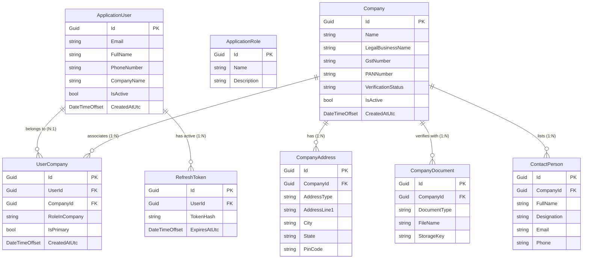

#### Drawing 2: Commercial & Sales Pipeline (Enquiries $\to$ Quotations)
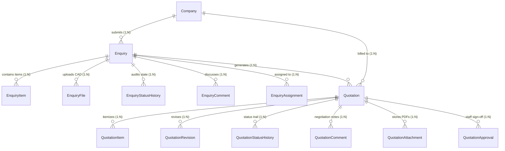

#### Drawing 3: Production Orders & Customer Milestones
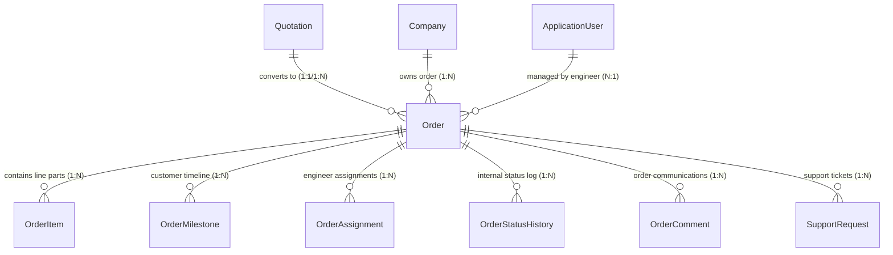

#### Drawing 4: 25-Stage Shop-Floor Manufacturing Engine
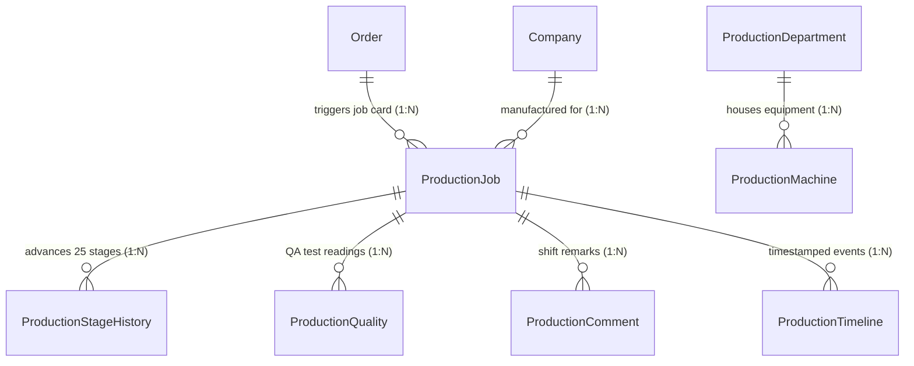

#### Drawing 5: Billing, Taxation & Financial Settlements
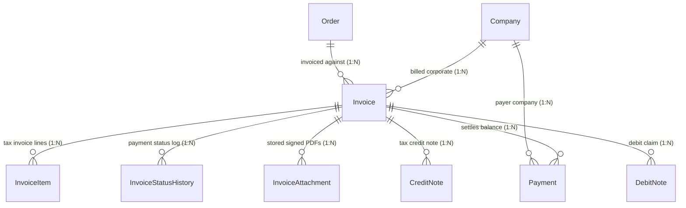

#### Drawing 6: Logistics, Dispatch & Controlled Documents
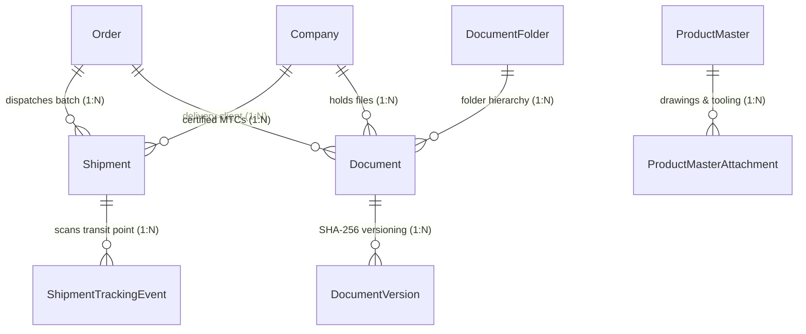

---

### 4.3 Comprehensive Foreign Key & Table Relationship Matrix

| Source Table | Foreign Key Column | Target Table (Primary Key) | Relationship Type | Delete Behavior | Functional Purpose |
| :--- | :--- | :--- | :--- | :--- | :--- |
| `UserCompanies` | `UserId` | `AspNetUsers(Id)` | Many-to-One | Cascade | Maps user to corporate accounts |
| `UserCompanies` | `CompanyId` | `Companies(Id)` | Many-to-One | Cascade | Multi-company tenancy mapping |
| `CompanyAddresses` | `CompanyId` | `Companies(Id)` | Many-to-One | Cascade | Factory, shipping, and registered offices |
| `CompanyDocuments` | `CompanyId` | `Companies(Id)` | Many-to-One | Cascade | GST, PAN, and MSME verification files |
| `ContactPersons` | `CompanyId` | `Companies(Id)` | Many-to-One | Cascade | Company personnel contact directory |
| `RefreshTokens` | `UserId` | `AspNetUsers(Id)` | Many-to-One | Cascade | JWT refresh token rotation chain |
| `PasswordResetTokens`| `UserId` | `AspNetUsers(Id)` | Many-to-One | Cascade | Secure single-use password resets |
| `Enquiries` | `CompanyId` | `Companies(Id)` | Many-to-One | Restrict | Customer quotation request ownership |
| `EnquiryItems` | `EnquiryId` | `Enquiries(Id)` | Many-to-One | Cascade | Line-level casting specifications |
| `EnquiryFiles` | `EnquiryId` | `Enquiries(Id)` | Many-to-One | Cascade | Uploaded CAD/STEP drawings |
| `EnquiryStatusHistory`| `EnquiryId`| `Enquiries(Id)` | Many-to-One | Cascade | Audit trail of enquiry lifecycle |
| `EnquiryComments` | `EnquiryId` | `Enquiries(Id)` | Many-to-One | Cascade | Discussion thread on enquiries |
| `EnquiryAssignments` | `EnquiryId` | `Enquiries(Id)` | Many-to-One | Cascade | Assignment routing to engineers |
| `Quotations` | `EnquiryId` | `Enquiries(Id)` | Many-to-One | Restrict | Commercial quote linked to enquiry |
| `Quotations` | `CompanyId` | `Companies(Id)` | Many-to-One | Restrict | Corporate quote recipient |
| `QuotationItems` | `QuotationId` | `Quotations(Id)` | Many-to-One | Cascade | Itemized line rates and tooling |
| `QuotationRevisions`| `QuotationId`| `Quotations(Id)` | Many-to-One | Cascade | Snapshot of quotation revisions |
| `QuotationStatusHistory`|`QuotationId`| `Quotations(Id)`| Many-to-One | Cascade | Status progression history |
| `QuotationComments` | `QuotationId` | `Quotations(Id)` | Many-to-One | Cascade | Commercial negotiation notes |
| `QuotationAttachments`|`QuotationId`| `Quotations(Id)` | Many-to-One | Cascade | Generated PDF proposals & annexures |
| `QuotationApprovals`| `QuotationId` | `Quotations(Id)` | Many-to-One | Cascade | Manager approval sign-offs |
| `Orders` | `CompanyId` | `Companies(Id)` | Many-to-One | Restrict | Confirmed manufacturing order |
| `Orders` | `QuotationId` | `Quotations(Id)` | Many-to-One | SetNull | Source quotation reference |
| `Orders` | `AssignedToUserId`| `AspNetUsers(Id)` | Many-to-One | SetNull | Assigned lead foundry engineer |
| `OrderItems` | `OrderId` | `Orders(Id)` | Many-to-One | Cascade | Ordered part numbers and quantities |
| `OrderMilestones` | `OrderId` | `Orders(Id)` | Many-to-One | Cascade | Customer-visible execution stages |
| `OrderAssignments` | `OrderId` | `Orders(Id)` | Many-to-One | Cascade | Shift engineer assignment log |
| `OrderStatusHistory`| `OrderId` | `Orders(Id)` | Many-to-One | Cascade | State audit log for orders |
| `OrderComments` | `OrderId` | `Orders(Id)` | Many-to-One | Cascade | Internal and customer remarks |
| `SupportRequests` | `OrderId` | `Orders(Id)` | Many-to-One | Restrict | Customer dispute or query ticket |
| `ProductionJobs` | `OrderId` | `Orders(Id)` | Many-to-One | SetNull | Shop-floor manufacturing job card |
| `ProductionJobs` | `CompanyId` | `Companies(Id)` | Many-to-One | Restrict | Company casting production |
| `ProductionStageHistory`|`JobId` | `ProductionJobs(Id)`| Many-to-One | Cascade | 25-stage Kanban transition history |
| `ProductionQualities`| `JobId` | `ProductionJobs(Id)`| Many-to-One | Cascade | Spectrometer & hardness test readings |
| `ProductionComments`| `JobId` | `ProductionJobs(Id)`| Many-to-One | Cascade | Shop-floor delay & shift remarks |
| `ProductionTimelines`| `JobId` | `ProductionJobs(Id)`| Many-to-One | Cascade | Automated milestone timestamps |
| `Invoices` | `CompanyId` | `Companies(Id)` | Many-to-One | Restrict | Customer billing account |
| `Invoices` | `OrderId` | `Orders(Id)` | Many-to-One | SetNull | Order invoiced against |
| `InvoiceItems` | `InvoiceId` | `Invoices(Id)` | Many-to-One | Cascade | HSN tax line items |
| `InvoiceStatusHistory`| `InvoiceId` | `Invoices(Id)` | Many-to-One | Cascade | Tax invoice status lifecycle |
| `InvoiceAttachments`| `InvoiceId` | `Invoices(Id)` | Many-to-One | Cascade | Stored PDF tax invoice files |
| `Payments` | `CompanyId` | `Companies(Id)` | Many-to-One | Restrict | Customer paying company |
| `Payments` | `InvoiceId` | `Invoices(Id)` | Many-to-One | SetNull | Invoice payment settlement |
| `CreditNotes` | `InvoiceId` | `Invoices(Id)` | Many-to-One | Restrict | Tax credit note adjustments |
| `DebitNotes` | `InvoiceId` | `Invoices(Id)` | Many-to-One | Restrict | Supplementary debit claims |
| `Shipments` | `OrderId` | `Orders(Id)` | Many-to-One | Restrict | Batch dispatch record |
| `Shipments` | `CompanyId` | `Companies(Id)` | Many-to-One | Restrict | Delivery recipient company |
| `ShipmentTrackingEvents`|`ShipmentId`| `Shipments(Id)` | Many-to-One | Cascade | In-transit GPS & checkpoint logs |
| `Documents` | `CompanyId` | `Companies(Id)` | Many-to-One | Restrict | Corporate vault file ownership |
| `Documents` | `OrderId` | `Orders(Id)` | Many-to-One | SetNull | Order-specific test certificates (MTC) |
| `Documents` | `FolderId` | `DocumentFolders(Id)`| Many-to-One | SetNull | Folder hierarchy placement |
| `DocumentVersions` | `DocumentId` | `Documents(Id)` | Many-to-One | Cascade | Controlled document version revisions |
| `ProductMasterAttachments`|`ProductMasterId`|`ProductMasters(Id)`| Many-to-One| Cascade | Pattern & master CAD attachments |

---

### 4.4 Comprehensive Entity Catalog

| Entity Name | Database Table | Primary Purpose & Key Fields |
| :--- | :--- | :--- |
| `ApplicationUser` | `AspNetUsers` | System user identity, hashed passwords, email, phone, company name, lockout state. |
| `ApplicationRole` | `AspNetRoles` | System role definitions (`Admin`, `Engineer`, `Customer`). |
| `RefreshToken` | `RefreshTokens` | SHA-256 hashed refresh tokens, expiry timestamp, rotated chain token reference. |
| `PasswordResetToken`| `PasswordResetTokens`| Single-use hashed reset tokens, 15-min expiry timestamp. |
| `UserCompany` | `UserCompanies` | Multi-tenant join mapping users to approved corporate accounts (`UserId`, `CompanyId`). |
| `Company` | `Companies` | Corporate profile, legal name, GST number, billing address, account approval state. |
| `CompanyAddress` | `CompanyAddresses` | Multi-address support: Factory, warehouse, registered office, shipping address. |
| `CompanyDocument`| `CompanyDocuments`| Verification documents (GST cert, MSME, PAN, cancelled cheque). |
| `ContactPerson` | `ContactPersons` | Departmental contact directory (Procurement Head, QA Lead, Accounts). |
| `ContactRequest` | `ContactRequests` | Inbound public contact enquiries with spam honeypot tracking. |
| `Enquiry` | `Enquiries` | Customer quotation requests and enquiries, target quantities, delivery requirements, status, `RowVersion`. |
| `EnquiryItem` | `EnquiryItems` | Line-level casting specifications, part numbers, alloy grade requirements. |
| `EnquiryFile` | `EnquiryFiles` | Uploaded CAD drawings (`.dwg`, `.step`, `.pdf`) with private storage keys. |
| `EnquiryStatusHistory`| `EnquiryStatusHistory`| Audit trail of enquiry lifecycle transitions with author role and notes. |
| `EnquiryComment` | `EnquiryComments` | Internal and customer-visible discussion threads on specific enquiries. |
| `EnquiryAssignment` | `EnquiryAssignments` | Ingestion routing assigning enquiries to specific estimation engineers. |
| `Quotation` | `Quotations` | Commercial proposal, unit rates, total tax, validity date, delivery timeline, warranty, `RowVersion`. |
| `QuotationItem` | `QuotationItems` | Itemized pricing: raw casting rate, machining charge, tooling cost, line total. |
| `QuotationRevision` | `QuotationRevisions` | Historical snapshots of revisions, delta differences, modification rationales. |
| `QuotationStatusHistory`| `QuotationStatusHistory`| Status tracking: Draft, Pending Approval, Issued, Accepted, Declined. |
| `QuotationComment` | `QuotationComments` | Notes exchanged during quote estimation and customer review. |
| `QuotationAttachment` | `QuotationAttachments`| Annexures, technical data sheets, and generated PDF quote proposals. |
| `QuotationApproval` | `QuotationApprovals` | Administrative approval or rejection decisions prior to quotation issuance. |
| `Order` | `Orders` | Confirmed production order, PO reference, advance percentage, assigned engineer, `RowVersion`. |
| `OrderItem` | `OrderItems` | Ordered qty, produced qty, inspected qty, dispatched qty per line item. |
| `OrderAssignment` | `OrderAssignments` | Assignment history linking orders to active foundry engineers. |
| `OrderMilestone` | `OrderMilestones` | Customer-visible progress points (Pattern, Moulding, Pouring, QA, Packing, Dispatched). |
| `OrderStatusHistory` | `OrderStatusHistory` | Order state progression log with operator IP and timestamps. |
| `OrderComment` | `OrderComments` | Production and execution remarks attached to orders. |
| `Shipment` | `Shipments` | Logistics record: Transporter name, vehicle registration number, driver phone, LR tracking number, dispatch and delivery timestamps, POD link. |
| `ShipmentTrackingEvent`| `ShipmentTrackingEvents`| Granular transit checkpoint scans and delivery status logs. |
| `ProductionJob` | `ProductionJobs` | Shop-floor production tracking unit, casting name, current manufacturing stage, priority, progress %. |
| `ProductionStage`| `ProductionStages`| 25-stage sequential manufacturing master definitions with color codes and icons. |
| `ProductionStageHistory`| `ProductionStageHistory`| Step-by-step physical movement log through melting, pouring, fettling, etc. |
| `ProductionQuality` | `ProductionQualities` | QA test readings (spectrometer chemistry, Brinell hardness, tensile, NDT results). |
| `ProductionComment` | `ProductionComments` | Shop-floor shift supervisor notes and delay alerts. |
| `ProductionTimeline` | `ProductionTimelines` | Automated shop-floor timestamped event logs. |
| `ProductionDepartment`| `ProductionDepartments`| Foundry operational departments (Melting, Moulding, Core Shop, Fettling, Machine Shop, QA). |
| `ProductionMachine` | `ProductionMachines` | Equipment registry (Induction Furnaces, Shot Blast Chambers, CNC Machines, Spectrometers). |
| `Invoice` | `Invoices` | Tax invoice, HSN/SAC breakdown, taxable amount, CGST/SGST/IGST, paid amount, balance due, `RowVersion`. |
| `InvoiceItem` | `InvoiceItems` | Tax invoice line items, HSN code, unit rate, tax rate percentage. |
| `InvoiceStatusHistory`| `InvoiceStatusHistory`| Invoice lifecycle tracking (Draft, Issued, Partially Paid, Paid, Overdue, Cancelled). |
| `InvoiceAttachment` | `InvoiceAttachments`| Stored PDF invoice documents and signed stamped copies. |
| `CreditNote` | `CreditNotes` | Tax credit adjustments for returns, shortages, or rate adjustments. |
| `DebitNote` | `DebitNotes` | Customer debit claims or supplementary freight charges. |
| `Payment` | `Payments` | Payment transaction records, bank reference (UTR/NEFT), payment method, verification status. |
| `Product` | `Products` | Marketing catalogue products, alloy families, casting capabilities, SEO slug. |
| `ProductMedia` | `ProductMedias` | High-resolution photography of castings, mouldings, and factory facilities. |
| `ProductMaster` | `ProductMasters` | Internal engineering master: drawing number, pattern code, standard weight, base alloy, tooling cost. |
| `ProductMasterAttachment`| `ProductMasterAttachments`| Master 2D/3D CAD models, pattern inspection sheets. |
| `Category` | `Categories` | Hierarchical casting categorization. |
| `Industry` | `Industries` | Vertical industry sectors and example cast components. |
| `Resource` | `Resources` | Technical articles, casting design guides, alloy comparison charts. |
| `Faq` | `Faqs` | Categorized technical and commercial FAQs. |
| `GalleryItem` | `GalleryItems` | Factory facility photos and product showcase media. |
| `Document` | `Documents` | Official document repository: MTCs, Inspection Reports, Invoices, Drawings. |
| `DocumentFolder`| `DocumentFolders`| Hierarchical document categorization tree. |
| `DocumentVersion`| `DocumentVersions`| Revision history and SHA-256 hash tracking for controlled engineering documents. |
| `Notification` | `Notifications` | In-app alerts, read status, actionable deep links. |
| `SupportRequest` | `SupportRequests` | Customer support, delivery inquiry, and technical dispute tickets. |
| `SystemSetting` | `SystemSettings` | Dynamic system configuration key-value storage. |
| `AuditLog` | `AuditLogs` | Immutable security audit trail: Action, Entity, OldValues, NewValues, IP, User ID, Timestamp. |
| `KanbanTask` | `KanbanTasks` | Internal administrative ad-hoc task board. |
| `UserBoardPreference`| `UserBoardPreferences`| Persisted Kanban board display options per operator (card size, visible columns). |

---

### 4.5 Low-Level Design (LLD) Visual Table Connection Wireframes

The following LLD UI schema layouts depict each database table as a visual schema card with primary keys, foreign keys, data types, and explicit string-connected relationship paths across all application pipelines.

#### LLD Pipeline 1: Identity, Multi-Tenancy & Corporate Structure Wireframe

```
┌────────────────────────────────────────────────────────┐
│                   AspNetUsers                          │
├────────────────────────────────────────────────────────┤
│ [PK] Id                  : UNIQUEIDENTIFIER            │
│      Email               : NVARCHAR(256)               │
│      FullName            : NVARCHAR(200)               │
│      PhoneNumber         : NVARCHAR(50)                │
│      IsActive            : BIT                         │
│      CreatedAtUtc        : DATETIMEOFFSET              │
└───────┬────────────────────────────┬───────────────────┘
        │ [1:N]                      │ [1:N]
        │                            │
 ──[FK: UserId]──►            ──[FK: UserId]──►
┌───────▼────────────────────────┐ ┌─▼───────────────────────────────────┐
│        UserCompanies           │ │          RefreshTokens              │
├────────────────────────────────┤ ├─────────────────────────────────────┤
│ [PK] Id           : GUID       │ │ [PK] Id           : GUID            │
│ [FK] UserId       : GUID       │ │ [FK] UserId       : GUID            │
│ [FK] CompanyId    : GUID       │ │      TokenHash    : NVARCHAR(88)    │
│      RoleInCompany: VARCHAR(50)│ │      ExpiresAtUtc : DATETIMEOFFSET  │
└───────▲────────────────────────┘ └─────────────────────────────────────┘
        │ [N:1]
 ──[FK: CompanyId]──
        │
┌───────┴────────────────────────────────────────────────┐
│                    Companies                           │
├────────────────────────────────────────────────────────┤
│ [PK] Id                  : UNIQUEIDENTIFIER            │
│      Name                : NVARCHAR(200)               │
│      LegalBusinessName   : NVARCHAR(200)               │
│      GstNumber           : NVARCHAR(20)                │
│      PANNumber           : NVARCHAR(20)                │
│      VerificationStatus  : NVARCHAR(50)                │
│      IsActive            : BIT                         │
│      CreatedAtUtc        : DATETIMEOFFSET              │
└───────┬────────────────────────────┬───────────────────┘
        │ [1:N]                      │ [1:N]
        │                            │
 ──[FK: CompanyId]──►         ──[FK: CompanyId]──►
┌───────▼────────────────────────┐ ┌─▼───────────────────────────────────┐
│       CompanyAddresses         │ │         CompanyDocuments            │
├────────────────────────────────┤ ├─────────────────────────────────────┤
│ [PK] Id           : GUID       │ │ [PK] Id           : GUID            │
│ [FK] CompanyId    : GUID       │ │ [FK] CompanyId    : GUID            │
│      AddressType  : VARCHAR(50)│ │      DocumentType : VARCHAR(50)     │
│      AddressLine1 : VARCHAR(200│ │      StorageKey   : NVARCHAR(200)   │
│      City         : VARCHAR(100│ │      FileName     : NVARCHAR(200)   │
└────────────────────────────────┘ └─────────────────────────────────────┘
```

#### LLD Pipeline 2: Sales, Enquiries & Commercial Quotation Engine

```
┌────────────────────────────────────────────────────────┐
│                    Companies                           │
│ [PK] Id : UNIQUEIDENTIFIER                             │
└───────┬────────────────────────────┬───────────────────┘
        │ [1:N]                      │ [1:N]
 ──[FK: CompanyId]──►                │
┌───────▼────────────────────────┐   │
│                   Enquiries    │   │
├────────────────────────────────┤   │
│ [PK] Id                  : GUID│   │
│ [FK] CompanyId           : GUID│   │
│      EnquiryNumber       : TEXT│   │
│      Status              : TEXT│   │
│      TargetQuantity      : INT │   │
│      CreatedAtUtc        : TIME│   │
└───────┬────────────┬───────────┘   │
        │ [1:N]      │ [1:N]         │
        │            │               │
 ──[FK: EnquiryId]──►│               │
┌───────▼────────────┴───────────┐   │
│           EnquiryItems         │   │
├────────────────────────────────┤   │
│ [PK] Id           : GUID       │   │
│ [FK] EnquiryId    : GUID       │   │
│      PartNumber   : VARCHAR(50)│   │
│      MaterialGrade: VARCHAR(50)│   │
│      Quantity     : INT        │   │
└────────────────────────────────┘   │
        │                            │
 ──[FK: EnquiryId]───────────────────┼───────────────────┐
        │                            │                   │
        │ [1:N]                      │ [1:N]             │
        │                            │                   │
 ──[FK: EnquiryId]──►         ──[FK: CompanyId]──►       │
┌───────▼────────────────────────┐ ┌─▼───────────────────▼───────────────┐
│           EnquiryFiles         │ │                Quotations           │
├────────────────────────────────┤ ├─────────────────────────────────────┤
│ [PK] Id           : GUID       │ │ [PK] Id                  : GUID     │
│ [FK] EnquiryId    : GUID       │ │ [FK] EnquiryId           : GUID     │
│      FileName     : TEXT       │ │ [FK] CompanyId           : GUID     │
│      ContentType  : TEXT       │ │      QuotationNumber     : TEXT     │
│      StorageKey   : TEXT       │ │      Subtotal            : DECIMAL  │
│      SizeBytes    : BIGINT     │ │      Tax                 : DECIMAL  │
└────────────────────────────────┘ │      Total               : DECIMAL  │
                                   │      ValidUntilUtc       : DATETIME │
                                   │      Status              : TEXT     │
                                   └───────┬─────────────┬───────────────┘
                                           │ [1:N]       │ [1:N]
                                    ──[FK: QuotationId]─►│
                                   ┌───────▼────────┐  ┌─▼───────────────┐
                                   │ QuotationItems │  │QuotationRevision│
                                   ├────────────────┤  ├─────────────────┤
                                   │[PK] Id  : GUID │  │[PK] Id   : GUID │
                                   │[FK] QId : GUID │  │[FK] QId  : GUID │
                                   │ Rate    : DEC  │  │ Revision : INT  │
                                   │ Tax     : DEC  │  │ Snapshot : JSON │
                                   └────────────────┘  └─────────────────┘
```

#### LLD Pipeline 3: Orders, 25-Stage Manufacturing & Shop-Floor Kanban

```
┌────────────────────────────────────────────────────────┐
│                   Quotations                           │
│ [PK] Id : UNIQUEIDENTIFIER                             │
└───────┬────────────────────────────────────────────────┘
        │ [1:1 / 1:N]
 ──[FK: QuotationId]──►
┌───────▼────────────────────────────────────────────────┐
│                     Orders                             │
├────────────────────────────────────────────────────────┤
│ [PK] Id                  : UNIQUEIDENTIFIER            │
│ [FK] CompanyId           : UNIQUEIDENTIFIER            │
│ [FK] QuotationId         : UNIQUEIDENTIFIER (Nullable) │
│ [FK] AssignedToUserId    : UNIQUEIDENTIFIER (Nullable) │
│      OrderNumber         : NVARCHAR(50)                │
│      Status              : NVARCHAR(50)                │
│      ManufacturingStage  : NVARCHAR(50)                │
│      TotalAmount         : DECIMAL(18,2)               │
│      AdvancePaidAmount   : DECIMAL(18,2)               │
│      PlacedAtUtc         : DATETIMEOFFSET              │
└───────┬────────────────────────────┬───────────────────┘
        │ [1:N]                      │ [1:N]
        │                            │
 ──[FK: OrderId]──►           ──[FK: OrderId]──►
┌───────▼────────────────────────┐ ┌─▼───────────────────────────────────┐
│         OrderMilestones        │ │             ProductionJobs          │
├────────────────────────────────┤ ├─────────────────────────────────────┤
│ [PK] Id           : GUID       │ │ [PK] Id                  : GUID     │
│ [FK] OrderId      : GUID       │ │ [FK] OrderId             : GUID     │
│      MilestoneCode: VARCHAR(50)│ │ [FK] CompanyId           : GUID     │
│      Title        : VARCHAR(100│ │      JobNumber           : TEXT     │
│      IsCompleted  : BIT        │ │      CurrentStage        : TEXT     │
│      CompletedAt  : DATETIME   │ │      TargetDispatchDate  : DATETIME │
└────────────────────────────────┘ │      IsBlocked           : BIT      │
                                   │      BlockReason         : TEXT     │
                                   └───────┬─────────────┬───────────────┘
                                           │ [1:N]       │ [1:N]
                                    ──[FK: JobId]──►     │
                                   ┌───────▼────────┐  ┌─▼───────────────┐
                                   │ProdStageHistory│  │ProductionQuality│
                                   ├────────────────┤  ├─────────────────┤
                                   │[PK] Id  : GUID │  │[PK] Id   : GUID │
                                   │[FK] JobId: GUID│  │[FK] JobId: GUID │
                                   │ FromStage:TEXT │  │ Hardness : DEC  │
                                   │ ToStage  :TEXT │  │ Chemistry: JSON │
                                   │ Operator :TEXT │  │ IsPassed : BIT  │
                                   └────────────────┘  └─────────────────┘
```

#### LLD Pipeline 4: Tax Invoicing, Credit Notes, Payments & Logistics Wireframe

```
┌────────────────────────────────────────────────────────┐
│                     Orders                             │
│ [PK] Id : UNIQUEIDENTIFIER                             │
└───────┬────────────────────────────┬───────────────────┘
        │ [1:N]                      │ [1:N]
 ──[FK: OrderId]──►           ──[FK: OrderId]──►
┌───────▼────────────────────────┐ ┌─▼───────────────────────────────────┐
│                    Invoices    │ │                   Shipments         │
├────────────────────────────────┤ ├─────────────────────────────────────┤
│ [PK] Id                  : GUID│ │ [PK] Id                  : GUID     │
│ [FK] OrderId             : GUID│ │ [FK] OrderId             : GUID     │
│ [FK] CompanyId           : GUID│ │ [FK] CompanyId           : GUID     │
│      InvoiceNumber       : TEXT│ │      ShipmentNumber      : TEXT     │
│      TaxableAmount       : DEC │ │      TransporterName     : TEXT     │
│      CGST                : DEC │ │      VehicleNumber       : TEXT     │
│      SGST                : DEC │ │      LrNumber            : TEXT     │
│      TotalAmount         : DEC │ │      DispatchedAtUtc     : DATETIME │
│      PaidAmount          : DEC │ │      Status              : TEXT     │
│      Status              : TEXT│ └───────┬─────────────────────────────┘
└───────┬────────────┬───────────┘         │ [1:N]
        │ [1:N]      │ [1:N]               │
 ──[FK: InvoiceId]──►│              ──[FK: ShipmentId]──►
┌───────▼────────┐ ┌─▼───────────┐ ┌───────▼─────────────────────────────┐
│  InvoiceItems  │ │  Payments   │ │        ShipmentTrackingEvents       │
├────────────────┤ ├─────────────┤ ├─────────────────────────────────────┤
│[PK] Id  : GUID │ │[PK] Id: GUID│ │ [PK] Id           : GUID            │
│[FK] InvId: GUID│ │[FK] InvId: G│ │ [FK] ShipmentId   : GUID            │
│ HsnCode : TEXT │ │ Amount: DEC │ │      Location     : NVARCHAR(100)   │
│ Rate    : DEC  │ │ Method: TEXT│ │      StatusNote   : NVARCHAR(200)   │
│ TaxRate : DEC  │ │ RefNo : TEXT│ │      EventTimeUtc : DATETIMEOFFSET  │
└────────────────┘ └─────────────┘ └─────────────────────────────────────┘
```

#### LLD Visual Flowchart Diagram with Typed Schema Connectors

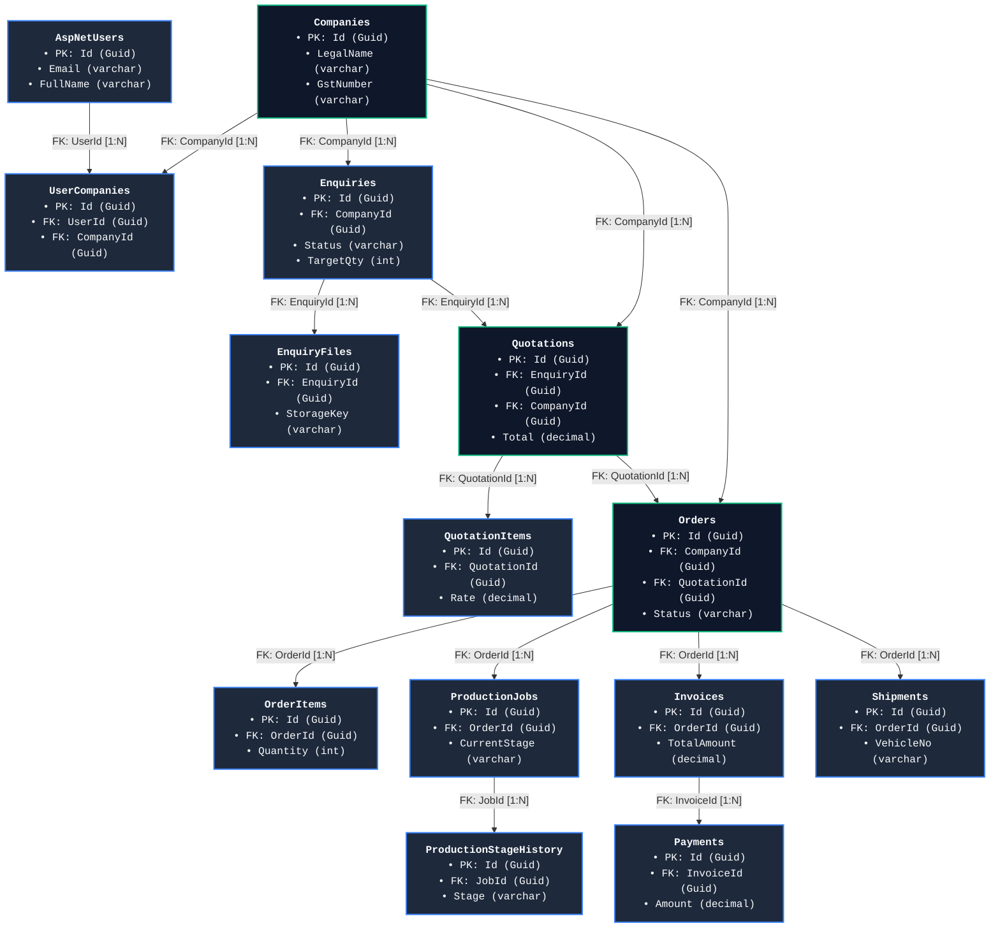

---

## 5. API Design & Complete Controller Architecture

The API exposes versioned RESTful endpoints rooted at `/api/v1/`.

```
/api/v1/
├── public/                 # PublicController (No auth, rate-limited)
├── auth/                   # AuthController & ExternalAuthController
├── customer/               # CustomerController (Company-isolated)
├── engineer/               # EngineerController & EngineerManufacturingController
├── admin/                  # AdminController, QuotationAdminController, InvoiceManagementController...
├── production/             # ProductionBoardController (25-stage Kanban)
├── kanban/                 # KanbanController (Internal tasks)
├── integrations/           # IntegrationsController (External Webhooks)
└── meta                    # MetaController & Health Checks (/health)
```

### 5.1 Controller Registry & Mapping Overview

| Controller Class | Route Base | Role / Policy | Key Purpose & Capabilities |
| :--- | :--- | :--- | :--- |
| `PublicController` | `/api/v1/public` | Anonymous | Public catalogue, alloy details, contact forms, public Enquiry ingestion. |
| `AuthController` | `/api/v1/auth` | Anonymous / User | Login, Token Refresh, Password Reset, Registration, `/me` profile. |
| `ExternalAuthController` | `/api/v1/auth/external` | Anonymous | Google OAuth & Apple Sign-In callbacks and session initialization. |
| `CustomerController` | `/api/v1/customer` | `CustomerOnly` | Enquiries, Quotation review, Order timeline, Payments, Invoices, Document streaming. |
| `EngineerController` | `/api/v1/engineer` | `EngineerOnly` | Assigned Enquiries, Quotation drafting, Order milestone updates, Shipments. |
| `EngineerManufacturingController`| `/api/v1/engineer/orders`| `EngineerOnly`| Dedicated manufacturing board orders and forward-only stage movement. |
| `AdminController` | `/api/v1/admin` | `AdminOnly` | Users, Engineers, Companies, Order assignment, Master data governance, Audit logs. |
| `QuotationAdminController` | `/api/v1/admin/quotations`| `AdminOnly` | Quotation approval, rejection, customer issuance, order conversion. |
| `QuotationEngineerController` | `/api/v1/engineer/quotations`| `EngineerOnly`| Quotation line item creation, draft editing, submission for approval. |
| `InvoiceManagementController` | `/api/v1/admin/invoices` | `AdminOnly` | Tax invoice generation, credit/debit notes, payment reconciliation. |
| `ProductionBoardController` | `/api/v1/production` | `EngineerOnly` | 25-stage manufacturing Kanban data, stage movements, QA recordings. |
| `ProductMasterController` | `/api/v1/admin/product-master`| `AdminOnly` | Engineering product master registry, usage stats, attachment management. |
| `AdminContentController` | `/api/v1/admin` | `AdminOnly` | Content approvals for FAQs, Products, Resources, Gallery media. |
| `ReportsController` | `/api/v1/admin/reports` | `AdminOnly` | Report generation and data streaming in CSV/Excel formats. |
| `IntegrationsController` | `/api/v1/integrations` | Shared Secret | Incoming external invoice and payment webhooks. |
| `KanbanController` | `/api/v1/kanban` | `AdminOnly` | Ad-hoc internal task board operations (CRUD, move). |
| `MetaController` | `/api/v1/meta` | Anonymous | API build metadata, environment diagnostics, `/health` endpoint. |

---

### 5.2 Exhaustive Endpoint Catalog by Controller

#### 1. Public API (`PublicController` — `/api/v1/public`)
* `GET /api/v1/public/products` $\to$ Returns list of published casting products and alloy specifications.
* `GET /api/v1/public/products/{slug}` $\to$ Returns product details by URL slug (404 if not found).
* `GET /api/v1/public/resources` $\to$ Returns list of published engineering articles and casting resources.
* `GET /api/v1/public/resources/{slug}` $\to$ Returns resource details by slug.
* `POST /api/v1/public/contact-requests` *(Rate limit: 20/min)* $\to$ Ingests contact message with honeypot validation.
* `POST /api/v1/public/enquiries` *(Rate limit: 20/min)* $\to$ Ingests public Enquiry with multi-file drawing attachments.

#### 2. Authentication API (`AuthController` — `/api/v1/auth`)
* `POST /api/v1/auth/login` *(Rate limit: 10/min)* $\to$ Authenticates user, issues 15-min JWT, sets HttpOnly refresh cookie.
* `POST /api/v1/auth/register` *(Rate limit: 10/min)* $\to$ Creates customer account, issues JWT and session cookie.
* `POST /api/v1/auth/refresh` *(Rate limit: 10/min)* $\to$ Validates and rotates refresh token, issues new JWT.
* `POST /api/v1/auth/forgot-password` *(Rate limit: 10/min)* $\to$ Generates single-use reset token; neutral response.
* `POST /api/v1/auth/reset-password` *(Rate limit: 10/min)* $\to$ Validates token, updates password, revokes active sessions.
* `POST /api/v1/auth/logout` $\to$ Revokes refresh token in database and clears HttpOnly cookie.
* `GET /api/v1/auth/me` *(Requires Auth)* $\to$ Returns authenticated user profile, assigned roles, and permissions.

#### 3. External OAuth (`ExternalAuthController` — `/api/v1/auth/external`)
* `POST /api/v1/auth/external/login` $\to$ Initiates Google or Apple OAuth challenge flow.
* `POST /api/v1/auth/external/callback` $\to$ Consumes OAuth authorization code, binds user, issues JWT session.
* `GET /signin-google` $\to$ ASP.NET Core Google OAuth middleware challenge endpoint.
* `GET /signin-apple` $\to$ Apple OpenID Connect form post callback endpoint.

#### 4. Customer Portal API (`CustomerController` — `/api/v1/customer`, Policy: `CustomerOnly`)
* `GET /api/v1/customer/dashboard` $\to$ Returns customer KPIs, active Enquiries, in-progress orders, recent documents.
* `GET /api/v1/customer/enquiries` $\to$ Returns paginated list of Enquiries belonging to caller's approved company.
* `GET /api/v1/customer/enquiries/{id}` $\to$ Returns full Enquiry details, drawing downloads, and timeline history.
* `POST /api/v1/customer/enquiries` $\to$ Creates a new customer Enquiry (draft or submitted).
* `PATCH /api/v1/customer/enquiries/{id}` $\to$ Updates a draft Enquiry prior to submission.
* `DELETE /api/v1/customer/enquiries/{id}` $\to$ Soft-deletes a draft Enquiry.
* `POST /api/v1/customer/enquiries/{id}/submit` $\to$ Submits draft Enquiry to engineering queue.
* `GET /api/v1/customer/enquiries/{id}/timeline` $\to$ Returns status progression history for the Enquiry.
* `POST /api/v1/customer/enquiries/{id}/files` $\to$ Uploads revision drawings to an existing Enquiry.
* `GET /api/v1/customer/quotations` $\to$ Lists commercial quotations issued to the customer company.
* `GET /api/v1/customer/quotations/{id}` $\to$ Returns itemized quotation details, pricing, terms, and PDF link.
* `GET /api/v1/customer/quotations/{id}/timeline` $\to$ Quotation revision and approval history.
* `POST /api/v1/customer/quotations/{id}/response` $\to$ Customer responds: **Accept**, **Decline**, or **Negotiate**.
* `GET /api/v1/customer/orders` $\to$ Lists active and completed production orders.
* `GET /api/v1/customer/orders/{id}` $\to$ Order details, line items, shipment transporter details, linked documents.
* `GET /api/v1/customer/orders/{id}/timeline` $\to$ Amazon-style 8-stage visual milestone progression.
* `POST /api/v1/customer/orders/{id}/support-requests` $\to$ Raises an order-linked support or clarification ticket.
* `POST /api/v1/customer/orders/{id}/pay-advance` $\to$ Submits advance payment transaction reference and receipt.
* `GET /api/v1/customer/invoices` $\to$ Lists issued tax invoices and outstanding balance due.
* `GET /api/v1/customer/invoices/{id}` $\to$ Returns itemized invoice details and linked payment records.
* `GET /api/v1/customer/documents` $\to$ Categorized document repository (MTCs, Invoices, Drawings, Packing Lists).
* `GET /api/v1/customer/documents/{id}/download` $\to$ Streams authenticated document binary after company check.
* `GET /api/v1/customer/notifications` $\to$ Retrieves in-app alerts and notifications.
* `POST /api/v1/customer/notifications/{id}/read` $\to$ Marks a notification as read.
* `GET /api/v1/customer/payments` $\to$ Payment history and verification states.
* `POST /api/v1/customer/payments/proof` $\to$ Submits bank transfer (NEFT/RTGS/UPI) payment proof.
* `GET /api/v1/customer/profile` $\to$ Returns profile details, company address book, and contact persons.
* `PATCH /api/v1/customer/profile` $\to$ Updates personal profile details.
* `POST /api/v1/customer/profile/change-password` $\to$ Changes user account password.
* `GET /api/v1/customer/addresses`, `POST ...`, `PUT ...`, `DELETE ...` $\to$ Manages corporate delivery addresses.
* `GET /api/v1/customer/contacts`, `POST ...`, `PUT ...`, `DELETE ...` $\to$ Manages departmental contact persons.

#### 5. Engineer Operations API (`EngineerController` — `/api/v1/engineer`, Policy: `EngineerOnly`)
* `GET /api/v1/engineer/dashboard` $\to$ Returns engineer workload metrics, assigned Enquiries, and active jobs.
* `GET /api/v1/engineer/enquiries` $\to$ Lists inbound Enquiries for technical review and estimation.
* `GET /api/v1/engineer/enquiries/{id}` $\to$ Detailed Enquiry technical assessment view with internal notes.
* `PATCH /api/v1/engineer/enquiries/{id}/status` $\to$ Updates Enquiry review status (e.g. Under Review, Approved).
* `PATCH /api/v1/engineer/enquiries/{id}/assign` $\to$ Assigns Enquiry to estimation engineer.
* `POST /api/v1/engineer/enquiries/{id}/comments` $\to$ Adds internal or customer-visible comment to Enquiry.
* `GET /api/v1/engineer/orders` $\to$ Lists orders assigned to current engineer (`AssignedToUserId` filter).
* `GET /api/v1/engineer/orders/{id}` $\to$ Order details (enforces assigned-engineer ownership 403 guard).
* `PATCH /api/v1/engineer/orders/{id}/milestones` $\to$ Updates production milestone (Pattern, Moulding, Pouring, QA).
* `POST /api/v1/engineer/orders/{id}/shipment` $\to$ Creates shipment record (Transporter, Vehicle #, Phone, LR #).
* `PATCH /api/v1/engineer/orders/{id}/shipments/{shipmentId}` $\to$ Updates shipment details.
* `DELETE /api/v1/engineer/orders/{id}/shipments/{shipmentId}` $\to$ Deletes shipment record.
* `POST /api/v1/engineer/orders/{id}/documents` $\to$ Uploads order MTC or inspection certificate.

#### 6. Engineer Manufacturing Board API (`EngineerManufacturingController` — `/api/v1/engineer`, Policy: `EngineerOnly`)
* `GET /api/v1/engineer/orders` $\to$ Returns orders currently active on the manufacturing Kanban board.
* `PATCH /api/v1/engineer/orders/{id}/stage` $\to$ Advances assigned order to next manufacturing stage (forward-only).

#### 7. Quotation Engineer API (`QuotationEngineerController` — `/api/v1/engineer/quotations`, Policy: `EngineerOnly`)
* `GET /api/v1/engineer/quotations` $\to$ Lists all quotations in draft or review.
* `GET /api/v1/engineer/quotations/{id}` $\to$ Returns detailed quotation calculation sheet.
* `POST /api/v1/engineer/quotations` $\to$ Creates a new draft quotation against an approved Enquiry.
* `PUT /api/v1/engineer/quotations/{id}` $\to$ Updates quotation line items, casting rates, machining charges, and taxes.
* `POST /api/v1/engineer/quotations/{id}/submit` $\to$ Submits draft quotation for Admin approval.
* `POST /api/v1/engineer/quotations/{id}/attachments` $\to$ Attaches technical annexure or drawing.
* `POST /api/v1/engineer/quotations/{id}/comments` $\to$ Adds internal calculation notes.

#### 8. Quotation Admin API (`QuotationAdminController` — `/api/v1/admin/quotations`, Policy: `AdminOnly`)
* `GET /api/v1/admin/quotations` $\to$ Master quotation list across all customer accounts.
* `GET /api/v1/admin/quotations/{id}` $\to$ Full quotation detail with revision history.
* `PATCH /api/v1/admin/quotations/{id}/approve` $\to$ Approves quotation for customer release.
* `PATCH /api/v1/admin/quotations/{id}/reject` $\to$ Rejects quotation with feedback to engineer.
* `PATCH /api/v1/admin/quotations/{id}/issue` $\to$ Formally issues quotation to customer portal.
* `PATCH /api/v1/admin/quotations/{id}/cancel` $\to$ Cancels quotation.
* `PATCH /api/v1/admin/quotations/{id}/override-status` $\to$ Administrative status override with audit reason.
* `GET /api/v1/admin/quotations/{id}/history` $\to$ Full revision and approval audit log.
* `POST /api/v1/admin/quotations/{quotationId}/create-order` $\to$ Converts accepted quotation into a confirmed Order.

#### 9. Admin Operations & Governance API (`AdminController` — `/api/v1/admin`, Policy: `AdminOnly`)
* `GET /api/v1/admin/orders` $\to$ Master order list across the entire plant.
* `GET /api/v1/admin/orders/{id}` $\to$ Complete order details and execution timeline.
* `PATCH /api/v1/admin/orders/{orderId}/verify-advance` $\to$ Confirms customer advance payment receipt.
* `PATCH /api/v1/admin/orders/{orderId}/stage` $\to$ Forces production stage update.
* `PATCH /api/v1/admin/orders/{id}/approve-update` $\to$ Approves customer-visible milestone update.
* `PATCH /api/v1/admin/orders/{id}/override-status` $\to$ Forces order status override.
* `PATCH /api/v1/admin/orders/{id}/cancel` $\to$ Cancels order with reason.
* `PATCH /api/v1/admin/orders/{orderId}/assign` $\to$ Assigns / reassigns / unassigns order to engineer.
* `GET /api/v1/admin/orders/{id}/history` $\to$ Full order status audit trail.
* `GET /api/v1/admin/users` $\to$ User directory management.
* `POST /api/v1/admin/users/invite` $\to$ Invites a new staff or customer user.
* `PATCH /api/v1/admin/users/{id}/roles` $\to$ Updates user system roles.
* `PATCH /api/v1/admin/users/{id}/lock` $\to$ Locks user account.
* `PATCH /api/v1/admin/users/{id}/unlock` $\to$ Unlocks user account.
* `GET /api/v1/admin/engineers` $\to$ Engineer directory and active workload distribution.
* `GET /api/v1/admin/companies` $\to$ Corporate customer registry and approval workflow.
* `PATCH /api/v1/admin/companies/{id}/status` $\to$ Approves or suspends corporate company access.
* `GET /api/v1/admin/audit-logs` $\to$ Paged immutable audit log viewer with old/new JSON diffs.
* `GET /api/v1/admin/deals/{orderId}` $\to$ Order deal settlement, financial reconciliation, and margin overview.

#### 10. Invoice Management API (`InvoiceManagementController` — `/api/v1/admin/invoices`, Policy: `AdminOnly`)
* `GET /api/v1/admin/invoices` $\to$ Master tax invoice list.
* `GET /api/v1/admin/invoices/{id}` $\to$ Itemized tax invoice with HSN breakdown and payments.
* `POST /api/v1/admin/invoices` $\to$ Generates tax invoice against confirmed order.
* `PATCH /api/v1/admin/invoices/{id}/status` $\to$ Updates invoice status (Issued, Paid, Overdue).
* `POST /api/v1/admin/invoices/{id}/credit-notes` $\to$ Issues tax credit note.
* `POST /api/v1/admin/invoices/{id}/debit-notes` $\to$ Issues supplementary debit note.
* `POST /api/v1/admin/invoices/{id}/attachments` $\to$ Uploads signed/stamped invoice copy.

#### 11. Production Board API (`ProductionBoardController` — `/api/v1/production`, Policy: `EngineerOnly`)
* `GET /api/v1/production/board` $\to$ Complete 25-stage manufacturing Kanban board data.
* `GET /api/v1/production/jobs` $\to$ Lists production jobs with stage and priority filter.
* `GET /api/v1/production/jobs/{id}` $\to$ Production job detail with QA readings, shift comments, and history.
* `POST /api/v1/production/jobs` $\to$ Creates a new shop-floor production job.
* `PUT /api/v1/production/jobs/{id}` $\to$ Updates production job parameters.
* `DELETE /api/v1/production/jobs/{id}` $\to$ Removes production job.
* `PUT /api/v1/production/jobs/{id}/stage` $\to$ Moves job to next manufacturing stage.
* `PUT /api/v1/production/jobs/{id}/quality` $\to$ Records QA lab test inspection results.
* `POST /api/v1/production/jobs/{id}/comments` $\to$ Adds shift supervisor comment.
* `PUT /api/v1/production/jobs/{id}/comments/{commentId}` $\to$ Edits comment.
* `DELETE /api/v1/production/jobs/{id}/comments/{commentId}` $\to$ Deletes comment.
* `GET /api/v1/production/dashboard` $\to$ Production throughput statistics and bottleneck metrics.
* `GET /api/v1/production/stages` $\to$ Master list of 25 manufacturing stages.
* `GET /api/v1/production/departments` $\to$ Foundry operational departments.
* `GET /api/v1/production/machines` $\to$ Equipment and machine registry.
* `GET /api/v1/production/preferences` $\to$ Retrieves operator's Kanban column and card preferences.
* `PUT /api/v1/production/preferences` $\to$ Saves operator's Kanban view settings.

#### 12. Engineering Product Master API (`ProductMasterController` — `/api/v1/admin/product-master`, Policy: `AdminOnly`)
* `GET /api/v1/admin/product-master` $\to$ Master casting pattern and tooling directory.
* `GET /api/v1/admin/product-master/{id}` $\to$ Pattern specifications, standard weight, and alloy requirements.
* `GET /api/v1/admin/product-master/{id}/usage` $\to$ Usage history across orders and quotes.
* `GET /api/v1/admin/product-master/stats` $\to$ Master tooling statistics.
* `POST /api/v1/admin/product-master` $\to$ Creates new master casting definition.
* `PUT /api/v1/admin/product-master/{id}` $\to$ Updates master definition.
* `DELETE /api/v1/admin/product-master/{id}` $\to$ Archives master record.
* `POST /api/v1/admin/product-master/{id}/duplicate` $\to$ Clones master casting definition.
* `POST /api/v1/admin/product-master/{id}/attachments` $\to$ Attaches master 2D/3D CAD models.
* `GET /api/v1/admin/product-master/{id}/attachments/{attachmentId}/download` $\to$ Downloads CAD drawing.

#### 13. Content Management API (`AdminContentController` — `/api/v1/admin`, Policy: `AdminOnly`)
* `GET /api/v1/admin/products`, `POST ...`, `PUT ...`, `DELETE ...` $\to$ Manages marketing catalogue products.
* `GET /api/v1/admin/categories`, `POST ...`, `PUT ...` $\to$ Manages product category taxonomy.
* `GET /api/v1/admin/industries`, `POST ...`, `PUT ...` $\to$ Manages industry application pages.
* `GET /api/v1/admin/resources`, `POST ...`, `PUT ...` $\to$ Manages technical whitepapers and articles.
* `GET /api/v1/admin/faqs`, `POST ...`, `PUT ...` $\to$ Manages customer and technical FAQs.
* `GET /api/v1/admin/gallery`, `DELETE /api/v1/admin/gallery/{id}` $\to$ Manages factory facility photo media.

#### 14. Executive Reporting API (`ReportsController` — `/api/v1/admin/reports`, Policy: `AdminOnly`)
* `GET /api/v1/admin/reports/{key}?format=csv|xlsx` $\to$ Generates and streams downloadable report datasets:
  * `order-pipeline`: Order status, promised vs actual delivery, value, quantities.
  * `revenue`: Invoices, taxes collected, outstanding receivables, payment reconciliation.
  * `production`: Monthly tonnage poured, scrap rates, QA rejection rates.

#### 15. Integrations & Webhooks (`IntegrationsController` — `/api/v1/integrations`)
* `POST /api/v1/integrations/invoice-webhook` $\to$ Receives and validates incoming external invoices.

#### 16. Internal Kanban API (`KanbanController` — `/api/v1/kanban`, Policy: `AdminOnly`)
* `GET /api/v1/kanban` $\to$ Lists internal administrative tasks.
* `POST /api/v1/kanban` $\to$ Creates internal task.
* `PATCH /api/v1/kanban/{id}/move` $\to$ Updates task column position.
* `PATCH /api/v1/kanban/{id}` $\to$ Updates task details.
* `DELETE /api/v1/kanban/{id}` $\to$ Removes task.

#### 17. System & Diagnostic API (`MetaController`)
* `GET /api/v1/meta` $\to$ API version, environment diagnostics, and build metadata.
* `GET /health` $\to$ ASP.NET Core Health Checks probing SQL Server database connectivity.
* `WS /hubs/portal` & `/api/v1/portal-hub` $\to$ SignalR WebSocket connection endpoint for real-time broadcasts.

---

## 6. Real-Time & Event Architecture

* **SignalR Hub Route:** `/hubs/portal` and `/api/v1/portal-hub`
* **Transport:** WebSockets (with Server-Sent Events / Long Polling fallback)
* **Events Dispatched:**
  * `OrderMilestoneUpdated(orderId, statusCode, message)`
  * `ProductionStageMoved(jobId, orderId, fromStage, toStage)`
  * `QuotationIssued(quotationId, customerCompanyId)`
  * `NotificationReceived(userId, notificationDto)`
* **Frontend Handler:** Managed via `frontend/src/realtime/signalR.ts`, providing automatic reconnection exponential backoff and localized cache invalidation.

---

## 7. Database Migrations & Versioning History

| Migration Number | Migration Identifier | Primary Structural Schema Additions |
| :--- | :--- | :--- |
| **01** | `InitialCreate` | Base ASP.NET Core Identity tables + `AuditLogs`. |
| **02** | `AddAuthTables` | `RefreshTokens`, `PasswordResetTokens`, `UserCompanies`. |
| **03** | `AddPublicSubmissions` | `Enquiries` (Customer Enquiries) and Public Contact Submissions. |
| **04** | `AddCustomerPortal` | `Companies`, `Products`, Customer Profile relationships. |
| **05** | `AddEnquiryModule` | `EnquiryItems`, `EnquiryFiles`, `EnquiryStatusHistory`, `EnquiryComments`, `EnquiryAssignments`. |
| **06** | `AddQuotationModule` | `Quotations`, `QuotationItems`, `QuotationRevisions`, `QuotationApprovals`. |
| **07** | `AddOrderModule` | `Orders`, `OrderItems`, `OrderMilestones`, `Shipments`. |
| **08** | `FixQuotationIsDeleted` | Soft-delete support on Quotations. |
| **09** | `AddProductModule` | `ProductMedias`, `Categories`, `Industries`, `Resources`, `Faqs`, `GalleryItems`. |
| **10** | `AddContentModule` | Content approval and draft tables. |
| **11** | `AddDocumentModule` | `Documents`, `DocumentFolders`, `DocumentVersions`. |
| **12** | `AddInvoiceModule` | `Invoices`, `InvoiceItems`, `CreditNotes`, `DebitNotes`, `Payments`. |
| **13-15** | `AddJiraModule` & Mappings | Initial Jira synchronization tables (later streamlined). |
| **16-17** | `AddKanbanTask` & Fixes | Internal `KanbanTasks` schema. |
| **19** | `AddProductionKanban` | `ProductionJobs`, `ProductionStages`, `ProductionQualities`, `ProductionDepartments`. |
| **20** | `AddUserBoardPreferences`| User board column and display customization table. |
| **21** | `AddCommentAuthorTracking`| Comment author name, role, and inline edit timestamps. |
| **22** | `AddEnquiryPriority` | `Priority` ranking on Enquiries. |
| **23** | `AddProductMaster` | `ProductMasters` and `ProductMasterAttachments`. |
| **24** | `AddOrderPaymentFields` | Advance payment deposit calculations on Orders. |
| **25** | `AddOrderAssignment` | `Order.AssignedToUserId` and `OrderAssignments` audit history. |
| **26** | `AddShipmentVehicleAndPhone`| Transporter, `VehicleNumber`, and driver `PhoneNumber` tracking. |
| **27** | `AddCustomerProfileEntities`| `CompanyAddresses`, `CompanyDocuments`, `ContactPersons`. |
| **28** | `AddSystemSettings` | Key-value application runtime settings. |
| **29** | `RemoveJiraTables` | Cleanup of redundant legacy tables. |
| **30** | `AddContactRequest` | Dedicated table for contact submissions. |
| **31** | `AddEnquiryRename` | Unified nomenclature alignment across entities. |
| **32** | `AddOrderAssignmentRefinements`| Refined assignment constraints. |
| **33** | `AddShipmentVehicleAndPhone`| Enhanced logistics data schema. |
| **34** | `AddManufacturingStageToOrder`| Direct `ManufacturingStage` tracking on Order entity. |
| **35** | `AddCompanyNameColumn` | Direct company denormalization column for high-speed indexing. |
