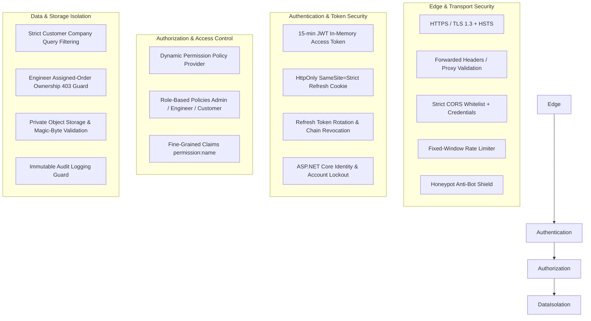
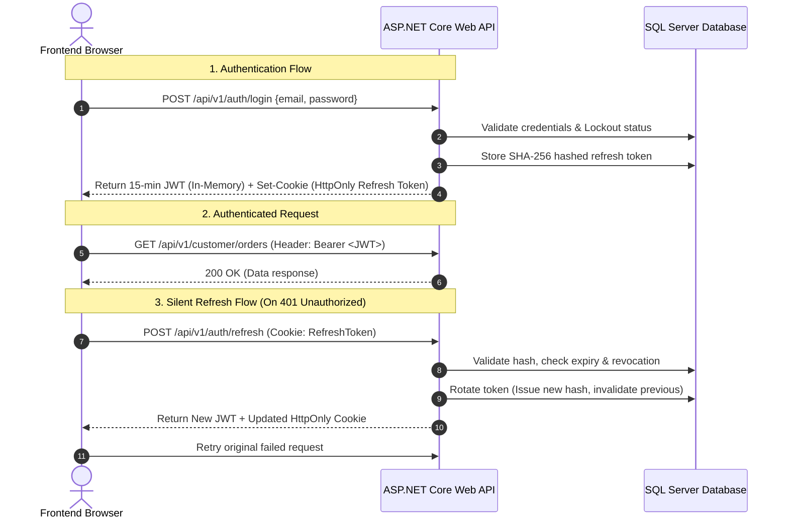

# Shakti Udyog — Security & Access Control Document (SAD)

> **Document Version:** 2.0  
> **Status:** Active / Source of Truth  
> **Last Updated:** August 2026  
> **Target Audience:** Security Engineers, Solution Architects, Backend Developers, DevOps, Compliance Auditors  

---

## 1. Security Architecture & Threat Model

The **Shakti Udyog Platform** operates on a **Zero-Trust Defense-in-Depth** security model. All business authorization, multi-tenant isolation, and data tampering protections are strictly enforced in the backend application and database tiers. Frontend route guards and UI state checks exist solely for user experience.



---

## 2. Authentication Architecture

### 2.1 Dual-Token Authentication Strategy



### 2.2 Token Specifications

| Parameter | Access Token (JWT) | Refresh Token |
| :--- | :--- | :--- |
| **Token Type** | JSON Web Token (RFC 7519) | Cryptographically Secure 64-byte Random String |
| **Storage Location** | **In-Memory JavaScript State Only** (Never in localStorage or sessionStorage) | **HttpOnly, Secure, SameSite=Strict Cookie** scoped strictly to path `/api/v1/auth` |
| **Time-to-Live (TTL)**| **15 Minutes** | **7 Days** |
| **Signing / Hashing**| HMAC-SHA256 (HS256) with min 32-byte key | SHA-256 Hashed at Rest in `RefreshTokens` table |
| **Clock Skew** | `TimeSpan.Zero` (Zero tolerance) | Timestamp UTC based |
| **Rotation Policy** | Continuous issuance on valid refresh | **Mandatory single-use rotation** on every `/refresh` |
| **Reuse Detection** | N/A | If a previously rotated token is presented, the **entire token family chain is immediately revoked**. |

### 2.3 Password Security & Policy
* **Password Hasher:** ASP.NET Core Identity PBKDF2 with HMAC-SHA512 and 100,000+ iterations.
* **Complexity Requirements:** Minimum 12 characters, requiring uppercase, lowercase, numeric digit, and non-alphanumeric symbol.
* **Brute-Force Lockout:** Account locks for **15 minutes** after **5 consecutive failed attempts**.
* **Password Reset Tokens:** Single-use, hashed at rest, expiring in **15 to 30 minutes**. The endpoint `POST /api/v1/auth/forgot-password` returns a constant generic success message to prevent user enumeration attacks.

---

## 3. Authorization & Permission Model

### 3.1 Role Hierarchy

| System Role | Portal Access | Scope of Authority |
| :--- | :--- | :--- |
| `Admin` | Admin Portal (`/admin/*`) | Global management: Users, roles, companies, approvals, financial invoices, system settings, immutable audit logs. |
| `Engineer` | Engineer Portal (`/admin/*`) | Operational execution: Enquiries review, quotation drafting, assigned order milestones, 25-stage manufacturing Kanban. |
| `Customer` | Customer Portal (`/customer/*`) | Corporate client access: View own company's RFQs, quotations, orders, invoices, payments, and document library. |

### 3.2 Fine-Grained Permission Matrix

```csharp
// Dynamic Policy Provider Pattern
[Authorize(Policy = "AdminOnly")]
[Authorize(Policy = "EngineerOnly")]
[Authorize(Policy = "CustomerOnly")]
[Authorize(Policy = "permission:invoice.manage")]
```

| Permission Key | Description | Admin | Engineer | Customer |
| :--- | :--- | :---: | :---: | :---: |
| `users.manage` | Invite, activate, deactivate, or lock user accounts | ✅ | ❌ | ❌ |
| `roles.manage` | Modify role assignments or fine-grained policies | ✅ | ❌ | ❌ |
| `companies.manage` | Approve new corporate accounts and tax profiles | ✅ | ❌ | ❌ |
| `content.edit` | Create and modify drafts of products, alloys, FAQs | ✅ | ✅ | ❌ |
| `content.publish` | Formally approve and publish marketing catalogue items | ✅ | ❌ | ❌ |
| `enquiry.read.assigned` | View inbound RFQs assigned to user | ✅ | ✅ | ❌ |
| `enquiry.update.assigned`| Update RFQ details and technical feasibility notes | ✅ | ✅ | ❌ |
| `quotation.create` | Draft cost sheets and quotation line items | ✅ | ✅ | ❌ |
| `quotation.approve` | Formally approve quotations for customer issuance | ✅ | ❌ | ❌ |
| `quotation.issue` | Transmit approved quotations to customer portal | ✅ | ❌ | ❌ |
| `order.update.assigned` | Update production milestones on assigned orders | ✅ | ✅ | ❌ |
| `order.publish.customer_status` | Authorize customer-visible status changes | ✅ | ❌ | ❌ |
| `production.move_stage` | Advance job across 25-stage Kanban board | ✅ | ✅ | ❌ |
| `production.quality_signoff`| Record chemical/mechanical QA test results | ✅ | ✅ | ❌ |
| `invoice.manage` | Issue tax invoices and generate credit/debit notes | ✅ | ❌ | ❌ |
| `payment.verify` | Verify offline bank transfer proofs (NEFT/RTGS/UPI) | ✅ | ❌ | ❌ |
| `audit.read` | Inspect immutable security and data audit logs | ✅ | ❌ | ❌ |
| `reports.export` | Generate executive PDF/CSV analytical exports | ✅ | ❌ | ❌ |

---

## 4. Multi-Tenant Data Isolation & Workload Ownership

### 4.1 Strict Customer Company Isolation

Customer accounts are linked to approved business accounts through the `UserCompanies` mapping table. Every customer API endpoint enforces dual-key validation:

```csharp
// Enforcement Pattern in CustomerService.cs
var companyId = await _contextService.GetApprovedCompanyIdAsync(userId);
if (companyId == null) throw new UnauthorizedAccessException("No approved company.");

var order = await _db.Orders
    .Where(o => o.Id == orderId && o.CompanyId == companyId)
    .FirstOrDefaultAsync();

if (order == null) return NotFound(); // Returns 404 rather than 403 to avoid probing
```

### 4.2 Engineer Workload Ownership Guard

Orders carry an explicit assignee (`Order.AssignedToUserId`). When an engineer attempts to modify milestone progress, update shipment details, or upload production documents:

```csharp
// Enforcement Pattern in OrderEngineerService.cs
if (!isAdmin && order.AssignedToUserId != currentUserId)
{
    throw new OrderAccessException("You are not authorized to update orders assigned to another engineer.");
    // Maps to HTTP 403 Forbidden
}
```

---

## 5. File Storage & Upload Security

* **Storage Abstraction:** Handled by `IFileStorageService` with local protected storage (pluggable with AWS S3 / Azure Blob Storage).
* **Location:** Files reside strictly outside the web root (`wwwroot`) in protected storage folders.
* **Magic-Byte Signature Verification:**
  * File uploads are not trusted by file extension or client `Content-Type` header alone.
  * The file header bytes are inspected for genuine signatures:
    * `PDF`: `%PDF-` (`0x25 0x50 0x44 0x46`)
    * `DWG`: `AC10` (`0x41 0x43 0x31 0x30`)
    * `ZIP / CAD Packages`: `PK` (`0x50 0x4B 0x03 0x04`)
    * `PNG / JPG`: Standard image magic numbers.
* **Size Restrictions:** Maximum 10 MB per individual upload; strictly enforced in middleware.
* **Authenticated Streaming:** Files are streamed directly through authorized controllers (`GET /api/v1/customer/documents/{id}/download`). No public URLs or direct disk paths are ever exposed.

---

## 6. Immutable Audit Trail System

All critical business transactions, authentication events, commercial changes, and stage movements write to the `AuditLogs` table.

```csharp
// Enforced in AppDbContext.cs
private void GuardAuditLogImmutability()
{
    var tampered = ChangeTracker.Entries<AuditLog>()
        .Any(e => e.State is EntityState.Modified or EntityState.Deleted);
    
    if (tampered)
    {
        throw new InvalidOperationException("Audit log entries are strictly immutable and cannot be modified or deleted.");
    }
}
```

### 6.1 Audited Events
1. **Authentication:** Login success, login failure, account lockout, password reset requests, session revocations.
2. **Commercials:** Quotation approvals, price modifications, invoice issuances, credit note creations, offline payment verifications.
3. **Operations:** Order assignment, milestone status updates, 25-stage Kanban forward moves, QA test approvals.
4. **Access Governance:** Role additions, user activations, company relationship approvals.

---

## 7. Network & Perimeter Defense

| Layer | Defense Mechanism | Configuration |
| :--- | :--- | :--- |
| **Transport** | TLS 1.3 / HSTS | HTTPS redirection enforced with HTTP Strict Transport Security (`max-age=31536000`). |
| **Reverse Proxy** | Forwarded Headers | Only explicitly trusted proxy IPs (`KnownProxies`) are permitted to supply `X-Forwarded-For`. |
| **CORS** | Strict Origin Whitelisting | Permitted only for `Frontend:BaseUrl` (e.g. `http://localhost:5173`) with `AllowCredentials` enabled. |
| **Rate Limiting** | Auth Partition | 10 requests per minute per IP on `/api/v1/auth/*` (HTTP 429). |
| **Rate Limiting** | Public Ingestion | 20 requests per minute per IP on public RFQ / contact submissions. |
| **Spam Defense** | Honeypot Field | Public forms include an invisible trap field (`website`). Bots filling this field receive a 200 OK fake success without persisting data. |
| **API Errors** | ProblemDetails RFC 7807 | Internal stack traces and SQL exceptions are masked behind a unique `TraceId`. |
