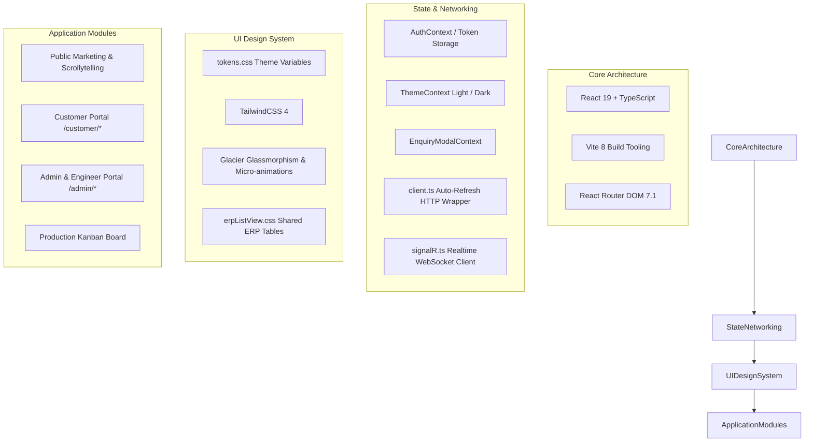
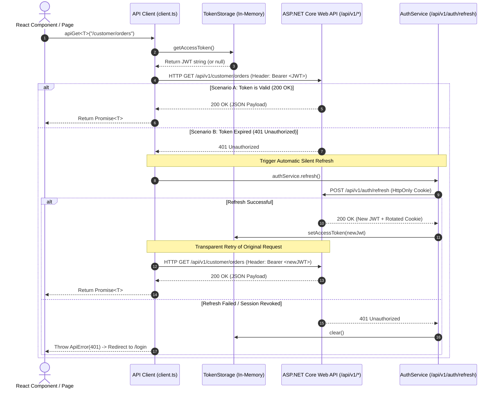

# Shakti Udyog — Frontend Specification Document (FSD)

> **Document Version:** 2.0  
> **Status:** Active / Source of Truth  
> **Last Updated:** August 2026  
> **Target Audience:** Frontend Engineers, UI/UX Designers, Full-Stack Developers, QA Engineers  

---

## 1. Frontend Architecture & Technology Stack

The **Shakti Udyog Frontend** is a modern Single Page Application (SPA) built on **React 19**, **TypeScript**, and **Vite 8**. It provides a unified client experience covering the public marketing website, authenticated customer portal, engineer operations board, and executive admin portal.



## 2. API Client Layer & Networking Architecture

The frontend communicates with the backend through a strongly typed, resilient API client layer anchored by [`frontend/src/api/client.ts`](file:///d:/Projects/Shakti%20Udyog/frontend/src/api/client.ts). It enforces strict security standards, manages token lifetimes transparently, and unifies error handling across the application.



### 2.1 Core API Client Capabilities (`client.ts`)

1. **Automatic In-Memory Bearer Token Injection:**
   - Every outgoing request queries `tokenStorage.getAccessToken()`. If present, it attaches the header `Authorization: Bearer <token>`.
   - Access tokens are strictly stored in JavaScript closures / memory and are **never written to localStorage, sessionStorage, or indexedDB**.

2. **Silent 401 Interception & Replay:**
   - When an API call returns `HTTP 401 Unauthorized`, the client intercepts the failure.
   - It invokes `authService.refresh()`, which sends the browser's `HttpOnly` cookie to `/api/v1/auth/refresh`.
   - If the refresh succeeds, the client updates in-memory token state and automatically retries the original request with `retryOn401 = false` to prevent infinite recursion.

3. **Standardized HTTP Request Wrappers:**
   - `apiGet<T>(path)`: Executes `GET` requests with JSON parsing.
   - `apiPost<T>(path, body)`: Sends JSON serialized payload with `Content-Type: application/json`.
   - `apiPatch<T>(path, body)`: Sends JSON delta updates.
   - `apiPut<T>(path, body)`: Sends full entity updates.
   - `apiDelete<T>(path)`: Sends `DELETE` request.
   - `apiUpload<T>(path, formData)`: Executes multi-part uploads letting the browser generate the dynamic `multipart/form-data` boundary.
   - `apiDownload(path, fallbackName)`: Authenticated file streaming helper. Fetches protected binary blob, extracts filename from `Content-Disposition` header, and triggers a clean programmatic browser download via transient `<a download>` object URL.

4. **RFC 7807 ProblemDetails Error Normalization (`ApiError`):**
   - Non-2xx responses parse the backend's `ProblemDetails` error payload.
   - Instantiates a typed `ApiError(status, traceId, message)` preserving the server `TraceId` for debugging.

```typescript
export class ApiError extends Error {
  readonly status: number;
  readonly traceId?: string;
  constructor(status: number, traceId?: string, message?: string) {
    super(message ?? `API request failed with status ${status}`);
    this.name = "ApiError";
    this.status = status;
    this.traceId = traceId;
  }
}
```

### 2.2 Typed Domain API Modules

The application partitions endpoints into domain-specific modules importing `client.ts`:

| API Module File | Target Domain | Key Typed Methods |
| :--- | :--- | :--- |
| `src/api/publicApi.ts` | Anonymous Visitors | `getProducts()`, `getProduct(slug)`, `getResources()`, `getResource(slug)`, `submitContact()`, `submitEnquiry()` |
| `src/api/customerApi.ts` | Customer Portal | `getDashboard()`, `getEnquiries()`, `createEnquiry()`, `getQuotations()`, `respondToQuote()`, `getOrders()`, `getOrderTimeline()`, `payAdvance()`, `getInvoices()`, `getDocuments()`, `downloadDocument()`, `getProfile()`, `updateProfile()` |
| `src/api/engineerApi.ts` | Engineer Operations | `getDashboard()`, `getAssignedEnquiries()`, `updateEnquiryStatus()`, `getAssignedOrders()`, `updateOrderMilestone()`, `createShipment()`, `getManufacturingBoardOrders()`, `advanceManufacturingStage()` |
| `src/api/adminApi.ts` | Admin Management | `getOrders()`, `assignOrder()`, `verifyAdvancePayment()`, `getUsers()`, `inviteUser()`, `getCompanies()`, `approveCompany()`, `getInvoices()`, `createInvoice()`, `getAuditLogs()`, `getDeals()`, `getReports()` |

---

## 3. Directory Structure & File Organization

```
frontend/
├── index.html                         # SPA root template
├── vite.config.ts                     # Vite build & plugin configuration
├── package.json                       # Dependencies (React 19, TailwindCSS 4, Recharts, Lucide)
├── src/
│   ├── main.tsx                       # Entry point mounting root DOM
│   ├── App.tsx                        # Master route configuration with ProtectedRoute
│   ├── config.ts                      # Runtime configuration (VITE_API_BASE_URL)
│   │
│   ├── api/                           # Strongly typed API client wrappers
│   │   ├── client.ts                  # Base fetch wrapper (JWT, 401 retry, trace IDs)
│   │   ├── publicApi.ts               # Public catalogue, contact, and Enquiry submissions
│   │   ├── customerApi.ts             # Customer portal endpoints
│   │   ├── engineerApi.ts             # Engineer endpoints & manufacturing board
│   │   └── adminApi.ts                # Admin management, users, invoices, audit logs
│   │
│   ├── auth/                          # Authentication & session management
│   │   ├── AuthContext.tsx            # Context provider for user state & session lifecycle
│   │   ├── authService.ts             # Login, refresh, logout, password reset calls
│   │   ├── oauthService.ts            # Google & Apple OAuth sign-in triggers
│   │   ├── ProtectedRoute.tsx         # Role-aware route guard component
│   │   ├── roles.ts                   # Role string constants (Admin, Engineer, Customer)
│   │   ├── tokenStorage.ts            # In-memory access token storage
│   │   └── ThemeContext.tsx           # Glacier dark/light theme switcher
│   │
│   ├── context/                       # Global state providers
│   │   └── EnquiryModalContext.tsx    # Global Enquiry modal trigger context
│   │
│   ├── realtime/                      # WebSockets & SignalR
│   │   └── signalR.ts                 # SignalR hub connection manager & event dispatch
│   │
│   ├── components/                    # Reusable components & interactive visuals
│   │   ├── PublicLayout.tsx           # Public header, navigation, and footer wrapper
│   │   ├── ProductionBoard.tsx        # 25-stage manufacturing Kanban component
│   │   ├── ScrollytellingCanvas.tsx   # Interactive scroll-based casting visualizer
│   │   ├── DeliveryScrollytellingCanvas.tsx # Logistics delivery visualizer
│   │   ├── AppleProductLineup.tsx     # Apple-style product carousel
│   │   ├── ProductMarqueeGallery.tsx  # Continuous sliding photo gallery
│   │   ├── TrustMetricStrip.tsx       # Live metric highlights (60+ yrs, 299 tonnes)
│   │   ├── RequestQuoteModal.tsx      # Multi-step Enquiry quotation request modal
│   │   ├── AdminCharts.tsx            # Recharts analytical widgets
│   │   ├── ui.tsx                     # Atoms: Button, Input, Select, Badge, Loading, Dialog
│   │   ├── sidebar/                   # Portal navigation sidebar
│   │   └── dashboard/                 # KPI stat cards and activity feeds
│   │
│   ├── pages/                         # Public marketing pages
│   │   ├── HomePage.tsx               # High-impact landing page
│   │   ├── AboutPage.tsx              # Factory history, mission, facility equipment
│   │   ├── ProductsPage.tsx           # Alloy catalogue (Grey Iron, SG Iron)
│   │   ├── ProductDetailPage.tsx      # Alloy technical specifications & applications
│   │   ├── CapabilitiesPage.tsx       # Melting, Moulding, Machining, Lab Testing
│   │   ├── QualityPage.tsx            # Quality control standards & certifications
│   │   ├── IndustriesPage.tsx         # Automotive, Agri, Pumps, Rail applications
│   │   ├── ResourcesPage.tsx          # Engineering whitepapers & casting checklists
│   │   ├── ContactPage.tsx            # Contact form with spam honeypot
│   │   ├── LegalPage.tsx              # Privacy policy, terms of use, cookie policy
│   │   └── NotFoundPage.tsx           # 404 error view
│   │
│   ├── portal/                        # Portal layout frames & views
│   │   ├── CustomerLayout.tsx         # Authenticated customer portal layout
│   │   ├── AdminLayout.tsx            # Authenticated admin/engineer portal layout
│   │   ├── pages/                     # 35+ Portal page components
│   │   │   ├── DashboardPage.tsx      # Customer dashboard
│   │   │   ├── AdminDashboardPage.tsx # Admin executive dashboard
│   │   │   ├── EngineerDashboardPage.tsx # Engineer operational dashboard
│   │   │   ├── EngineerBoardPage.tsx  # Dynamic manufacturing board view
│   │   │   ├── OrdersPage.tsx         # Customer orders list & tracking
│   │   │   ├── InvoicesPage.tsx       # Customer invoice downloads
│   │   │   ├── QuotationsPage.tsx     # Customer quotation approval view
│   │   │   ├── AdminDealPage.tsx      # Admin order financial overview
│   │   │   ├── AdminInvoiceManagePage.tsx # Admin tax invoice management
│   │   │   ├── AdminAuditLogsPage.tsx # Immutable security audit viewer
│   │   │   ├── AdminReportsPage.tsx   # Report generation and export view
│   │   │   └── erpListView.css        # Shared ERP table styling system
│   │   └── pages/engineer/            # Dedicated engineer sub-pages
│   │       ├── CreateQuotationPage.tsx# Quotation builder & cost estimator
│   │       ├── EnquiryListPage.tsx    # Inbound Enquiry review list
│   │       ├── EnquiryDetailPage.tsx  # Enquiry technical assessment view
│   │       └── OrderListPage.tsx      # Assigned orders management
│   │
│   ├── styles/                        # Styling tokens & global CSS
│   │   ├── tokens.css                 # CSS custom properties & color palette
│   │   ├── site.css                   # Glassmorphism utilities & base styles
│   │   └── tailwind.css               # TailwindCSS directives
│   │
│   └── content/                       # Typed static content definitions
│       ├── home.ts, about.ts, capabilities.ts, quality.ts, industries.ts, faqs.ts, seo.ts
```

---

## 3. UI Design System ("Glacier" Glassmorphism & ERP Standards)

### 3.1 Design Language & Tokens (`tokens.css` / `site.css`)
* **Visual Theme:** "Glacier" Dark Theme (Deep navy-black surfaces, luminous borders, frosted glass overlays, glowing interactive accents).
* **Base Surfaces:**
  * Background App: `--bg-app: #0a0e1a`
  * Card / Panel Surface: `--bg-card: #111827` (with `backdrop-filter: blur(16px)`)
  * Sidebar: `--bg-sidebar: #0B1220`
  * Input Surface: `--bg-input: rgba(15, 21, 36, 0.55)`
* **Brand Accents:**
  * Primary Accent: `--color-primary: #3B82F6` (Electric Ice Blue)
  * Secondary Glow: `--color-lavender: #c8a0f0` (Soft Purple)
  * Success Accent: `--color-success: #22C55E`
  * Warning Accent: `--color-warning: #F59E0B`
  * Danger Accent: `--color-danger: #EF4444`

### 3.2 Standardized ERP List Views (`erpListView.css`)

All portal data tables (Invoices, Quotations, Orders, Enquiries, Payments, Users, Audit Logs) share a single unified stylesheet using `.inv-*` class conventions.

```html
<div className="inv-page">
  <!-- 1. Header & Actions -->
  <div className="inv-header">
    <div>
      <h1 className="inv-header__title">Quotations</h1>
      <p className="inv-header__subtitle">Review and manage commercial proposals</p>
    </div>
    <div className="inv-header__actions">...</div>
  </div>

  <!-- 2. KPI Summary Grid -->
  <div className="inv-kpi-grid">
    <div className="inv-kpi" style={{ "--inv-kpi-color": "#3B82F6" }}>
      <span className="inv-kpi__value">24</span>
      <span className="inv-kpi__label">Active Quotes</span>
    </div>
  </div>

  <!-- 3. Search & Filter Bar -->
  <div className="inv-filterbar">
    <input className="inv-input" placeholder="Search by quotation #..." />
    <select className="inv-select">...</select>
    <button className="inv-btn inv-btn--icon"><RefreshCw size={16} /></button>
  </div>

  <!-- 4. Desktop Scroll Table -->
  <div className="inv-table-wrap">
    <div className="inv-scroll">
      <table className="inv-table">
        <thead>...</thead>
        <tbody>...</tbody>
      </table>
    </div>
  </div>

  <!-- 5. Mobile Responsive Cards (< 900px) -->
  <div className="inv-mobile">
    <div className="inv-card">...</div>
  </div>

  <!-- 6. Pagination Controls -->
  <div className="inv-pagination">...</div>
</div>
```

### 3.3 Status Badge Tone Conventions

```tsx
<span className={`inv-badge inv-badge--${tone}`}>{statusText}</span>
```

| Tone | Typical Mappings |
| :--- | :--- |
| `green` | Accepted, Approved, Paid, Verified, Delivered, Pass |
| `red` | Cancelled, Declined, Rejected, Overdue, Expired, Fail |
| `orange` | Pending Approval, Issued, Negotiating, Partially Paid, Conditional |
| `purple` | Viewed, Converted, Credit Note Issued |
| `blue` | Draft, In Production, Open |
| `gray` | Neutral, Unknown |

---

## 4. Complete Application Route Catalog

### 4.1 Public Routes

| Route Path | Component | Description & Key Behavior |
| :--- | :--- | :--- |
| `/` | `HomePage` | Marketing hero, Apple-style product lineup, scrollytelling visualizer, marquee gallery. |
| `/about` | `AboutPage` | Company history (1965), mission, vision, foundry equipment details. |
| `/products` | `ProductsPage` | Dynamic casting catalogue fetched via `publicApi.getProducts()`. |
| `/products/:slug` | `ProductDetailPage` | Detailed alloy grades, mechanical properties, and typical engineering uses. |
| `/capabilities` | `CapabilitiesPage` | Core making, moulding, melting, fettling, machining, and inspection capabilities. |
| `/quality` | `QualityPage` | Metallurgical lab standards, spectrometer checks, NDT certifications. |
| `/industries` | `IndustriesPage` | Vertical sector solutions (Auto, Agri, Pumps, Valves, Machine Tools). |
| `/resources` | `ResourcesPage` | Casting design guides, alloy comparisons, engineering checklists. |
| `/resources/:slug` | `ResourceDetailPage` | Technical whitepapers and casting procurement guidelines. |
| `/contact` | `ContactPage` | Contact form with honeypot anti-bot protection. |
| `/request-a-quote` | `RequestQuoteRedirect` | Opens `RequestQuoteModal` via `EnquiryModalContext` with smooth `/` redirect. |
| `/privacy-policy` | `LegalPage` | Privacy policy and data retention disclosures. |
| `/terms-of-use` | `LegalPage` | Terms of service and commercial agreements. |
| `/cookie-policy` | `LegalPage` | Cookie policy and token usage disclosures. |
| `*` | `NotFoundPage` | 404 handler with return navigation. |

### 4.2 Authentication Routes

| Route Path | Component | Description |
| :--- | :--- | :--- |
| `/login` | `LoginPage` | Email/password sign-in + Google/Apple OAuth triggers. |
| `/signup` | `SignUpPage` | Corporate customer registration form. |
| `/forgot-password` | `ForgotPasswordPage` | Email submission for password reset link. |
| `/reset-password` | `ResetPasswordPage` | Single-use token verification and new password creation. |
| `/auth/callback` | `AuthCallbackPage` | OAuth return handler parsing tokens and establishing session. |
| `/unauthorized` | `UnauthorizedPage` | Displayed when user lacks required role permissions. |
| `/access-denied` | `AccessDeniedPage` | Access denied error view. |

### 4.3 Customer Portal Routes (`/customer/*`)

*Guard: `ProtectedRoute roles={[Roles.Customer]}` | Layout: `CustomerLayout`*

| Route Path | Component | Key Features |
| :--- | :--- | :--- |
| `/customer/dashboard` | `DashboardPage` | Summary metric cards, open Enquiries, active orders, recent documents. |
| `/customer/enquiries` | `EnquiryListPage` | Paginated enquiry list with status filter. |
| `/customer/enquiries/new` | `EnquiryNewPage` | Multi-step Enquiry submission form with drawing uploader. |
| `/customer/enquiries/:id` | `EnquiryDetailPage` | Technical status timeline, engineer notes, downloadable drawings. |
| `/customer/enquiries/:id/edit` | `EnquiryEditPage` | Draft editor prior to final submission. |
| `/customer/quotations` | `QuotationListPage` | Received quotations with commercial totals and validity indicators. |
| `/customer/quotations/:id` | `QuotationDetailPage` | Line items, commercial terms, direct Accept / Decline actions. |
| `/customer/orders` | `OrderListPage` | Active orders with progress indicators and expected dispatch dates. |
| `/customer/orders/:id` | `OrderDetailPage` | Order details, line items, shipment transporter details, documents. |
| `/customer/orders/:id/timeline` | `OrderTimelinePage` | Amazon-style 8-stage visual delivery timeline. |
| `/customer/invoices` | `InvoiceListPage` | Invoices with payment status, outstanding balance, and PDF downloads. |
| `/customer/invoices/:id` | `InvoiceDetailPage` | Itemized invoice breakdown and linked payment receipts. |
| `/customer/documents` | `DocumentsPage` | Downloadable categorized document library (Drawings, MTCs, Invoices). |
| `/customer/notifications` | `NotificationsPage` | In-app alerts with mark-as-read controls. |
| `/customer/profile` | `ProfilePage` | Personal details, company profile, address book, contact persons, password change. |
| `/customer/payments` | `PaymentsPage` | Payment history and bank transfer proof uploader. |
| `/customer/company` | `CompanyPage` | Company details, GST number, registered delivery addresses. |
| `/customer/settings` | `SettingsPage` | User preferences and portal notification settings. |
| `/customer/support` | `SupportPage` | Order-linked technical support ticket submission. |

### 4.4 Admin & Engineer Portal Routes (`/admin/*`)

*Guard: `ProtectedRoute roles={[Roles.Admin, Roles.Engineer]}` | Layout: `AdminLayout`*

| Route Path | Component | Role Access | Key Capabilities |
| :--- | :--- | :--- | :--- |
| `/admin/dashboard` | `PortalDashboardSwitch` | Admin / Engineer | Switches between `AdminDashboardPage` and `EngineerDashboardPage`. |
| `/admin/enquiries` | `EngineerEnquiryListPage` | Admin / Engineer | Inbound Enquiry queue with assignment and review filters. |
| `/admin/enquiries/:id` | `EngineerEnquiryDetailPage`| Admin / Engineer | Technical feasibility review, drawing download, status updates. |
| `/admin/quotations` | `EngineerQuotationListPage`| Admin / Engineer | Master quotation list with approval states. |
| `/admin/quotations/new` | `CreateQuotationPage` | Admin / Engineer | Itemized quotation builder (raw casting, machining, tooling). |
| `/admin/quotations/:id` | `AdminQuotationDetailPage` | Admin / Engineer | Admin approval, rejection, and customer issuance controls. |
| `/admin/orders` | `EngineerOrderListPage` | Admin / Engineer | Orders list (Engineers see assigned only; Admins see all). |
| `/admin/orders/:id` | `AdminOrderDetailPage` | Admin / Engineer | Line items, milestones, shipments, document management. |
| `/admin/production` | `EngineerBoardPage` | Admin / Engineer | 25-stage manufacturing Kanban with drag-and-drop. |
| `/admin/manufacturing` | `EngineerBoardPage` | Admin / Engineer | Production Kanban alias. |
| `/admin/invoices` | `AdminInvoiceManagePage` | Admin | Tax invoice creation, status tracking, PDF generation. |
| `/admin/invoices/new` | `AdminInvoiceCreatePage` | Admin | Invoice builder against confirmed orders. |
| `/admin/deals/:orderId` | `AdminDealPage` | Admin | Financial deal settlement, payments, and balance overview. |
| `/admin/users` | `AdminUsersPage` | Admin only | Customer & staff user account invitations, locks, resets. |
| `/admin/engineers` | `AdminEngineersPage` | Admin only | Engineer directory, active workloads, assignment stats. |
| `/admin/companies` | `AdminCompaniesPage` | Admin only | Corporate customer approvals, GST verification, tax settings. |
| `/admin/products` | `AdminProductPage` | Admin / Engineer | Product catalogue master editor. |
| `/admin/products/:id` | `AdminProductDetailPage` | Admin / Engineer | Product alloy details, application tags, media manager. |
| `/admin/categories` | `AdminCategoryPage` | Admin / Engineer | Category taxonomy management. |
| `/admin/profile` | `AdminProfilePage` | Admin / Engineer | Operator profile, credentials, and password management. |
| `/admin/settings` | `AdminSettingsPage` | Admin only | Application runtime settings and system variables. |
| `/admin/audit-logs` | `AdminAuditLogsPage` | Admin only | Security and transaction audit log viewer with IP/delta inspection. |
| `/admin/reports` | `AdminReportsPage` | Admin only | Executive reporting dashboard with QuestPDF & CSV/Excel export. |

---

## 5. Key Interactive Components

### 5.1 25-Stage Production Kanban (`ProductionBoard.tsx`)
* **Interactive Drag-and-Drop:** Jobs can be dragged across 25 sequential columns with validation preventing backward or multi-stage skips.
* **Job Cards:** Display casting name, job #, customer company, weight, priority badge (`Critical`, `High`, `Medium`, `Low`), progress bar, and overdue indicators.
* **Side Drawer Panel:** Detailed job inspection with 4 tabs:
  1. *Overview:* Line item details, assigned machine, operator, scheduled dates.
  2. *Quality:* Chemical spectrometer readings, hardness scores, defect logs, inspector sign-off.
  3. *Comments:* Threaded operator shift notes with author role badges.
  4. *Timeline:* Timestamped stage transition history.
* **Operator Preferences:** Persists column visibility and card compact/expanded modes.

### 5.2 Scrollytelling Visualizer (`ScrollytellingCanvas.tsx`)
* Seamless scroll-driven canvas animating the foundry casting journey:
  $$\text{CAD Drawing} \longrightarrow \text{Sand Moulding} \longrightarrow \text{Molten Metal Pouring} \longrightarrow \text{CNC Machining} \longrightarrow \text{Final QA}$$
* Uses hardware-accelerated CSS transforms and HTML5 Canvas interpolation.

---

## 6. Responsive Breakpoints & Mobile Optimization

| Breakpoint Key | Min Width | Target Devices | Layout Adaptations |
| :--- | :--- | :--- | :--- |
| **Mobile (Default)** | $0\text{ px}$ | Smart Phones | Single column grid, `.inv-mobile` card list active, sticky bottom bar. |
| **Tablet (`sm`/`md`)**| $640\text{ px} - 768\text{ px}$ | iPad / Tablets | 2-column KPI grid, collapsible sidebar overlay. |
| **Desktop (`lg`)** | $1024\text{ px}$ | Laptops & Desktops | Permanent sidebar, `.inv-table-wrap` active with internal horizontal scroll. |
| **Wide (`xl`/`2xl`)** | $1280\text{ px}+$ | Large Monitors | Full 25-stage Kanban horizontal scrollboard, multi-chart dashboard. |
