# Shakti Udyog — Feature Ticket List (FTL)

> **Document Version:** 2.0  
> **Status:** Active / Source of Truth  
> **Last Updated:** August 2026  
> **Target Audience:** Product Managers, Engineering Leads, Scrum Masters, Developers, QA  

---

## 1. Overview & Epic Summary

This document defines the complete functional ticket breakdown for the **Shakti Udyog Platform**, organized across 13 core Epics covering foundation, operations, commercial workflows, and future roadmap items.

```mermaid
graph LR
    Epic1[Epic 1: Identity & Auth] --> Epic2[Epic 2: Public Marketing]
    Epic2 --> Epic3[Epic 3: Enquiries]
    Epic3 --> Epic4[Epic 4: Quotations]
    Epic4 --> Epic5[Epic 5: Customer Portal]
    Epic4 --> Epic6[Epic 6: Engineer Operations]
    Epic6 --> Epic7[Epic 7: Manufacturing Kanban]
    Epic7 --> Epic8[Epic 8: Logistics & Shipments]
    Epic8 --> Epic9[Epic 9: Invoicing & Finance]
    Epic9 --> Epic10[Epic 10: Documents]
    Epic10 --> Epic11[Epic 11: Admin & Audit]
    Epic11 --> Epic12[Epic 12: Reports & Analytics]
    Epic12 --> Epic13[Epic 13: Future Roadmap]
```

---

## 2. Epics & Feature Ticket Registry

### Epic 1: Identity, Authentication & Security Governance

| Ticket ID | Title | Priority | Target Role | Status |
| :--- | :--- | :--- | :--- | :--- |
| `AUTH-101` | **Dual-Token Authentication (JWT + Refresh Cookie)** | `P0` | All | `Completed` |
| `AUTH-102` | **Refresh Token Rotation & Chain Revocation** | `P0` | All | `Completed` |
| `AUTH-103` | **Neutral-Response Password Reset Flow** | `P0` | All | `Completed` |
| `AUTH-104` | **Account Lockout & Brute-Force Defense** | `P0` | System | `Completed` |
| `AUTH-105` | **Dynamic Permission Policy Engine (`permission:<name>`)** | `P0` | System | `Completed` |
| `AUTH-106` | **OAuth Integration (Google & Apple Sign-In)** | `P1` | Customer / Staff | `Completed` |
| `AUTH-107` | **Multi-Device Persistent Session Management & Remote Revocation** | `P0` | All | `Completed` |

#### `AUTH-101`: Dual-Token Authentication
* **User Story:** As a user, I want to securely log in with my email and password so that I can access my designated portal with an automatically renewing session.
* **Acceptance Criteria:**
  - `POST /api/v1/auth/login` returns a 15-minute JWT in the response body.
  - An `HttpOnly`, `Secure`, `SameSite=Strict` cookie containing a 64-byte random refresh token is set scoped to `/api/v1/auth`.
  - Frontend keeps JWT in memory only and never stores tokens in `localStorage` or `sessionStorage`.

#### `AUTH-107`: Multi-Device Persistent Session Management & Remote Revocation
* **User Story:** As a user, I want to view all active devices signed into my account, see their location, device type, and last active time, and remotely log out individual or all other devices in real-time.
* **Acceptance Criteria:**
  - Decoupled `UserSession` entity (1:N with `RefreshToken`) with User-Agent parsing (Browser, OS, Device Type, Location).
  - 15-minute JWT access tokens embed the session ID (`sid` claim).
  - Single-use token rotation preserves existing `SessionId` and updates `LastActiveAtUtc`.
  - Remote session revocation (`DELETE /api/v1/auth/sessions/{sessionId}` and `POST /api/v1/auth/sessions/revoke-others`) transactionally revokes database session and broadcasts `SessionRevoked` via SignalR to `user:{userId}`.
  - Offline devices are rejected on their next refresh request; cross-user session tampering returns `403 Forbidden` / `404 Not Found`.
  - Frontend `DevicesSessionsCard` component provides visual device indicators, `This Device` badge, and remote logout dialogs.

---

### Epic 2: Public Website & Marketing Experience

| Ticket ID | Title | Priority | Target Role | Status |
| :--- | :--- | :---: | :--- | :---: |
| `PUB-201` | **Responsive Marketing Layout & Navigation** | `P0` | Visitor | `Completed` |
| `PUB-202` | **Dynamic Casting Product Catalog** | `P0` | Visitor | `Completed` |
| `PUB-203` | **Scrollytelling Interactive Casting Canvas** | `P1` | Visitor | `Completed` |
| `PUB-204` | **Apple-Style Alloy Lineup & Marquee Gallery** | `P1` | Visitor | `Completed` |
| `PUB-205` | **Public Contact Form with Anti-Bot Honeypot** | `P0` | Visitor | `Completed` |
| `PUB-206` | **Direct Enquiry Modal Overlay (`/request-a-quote`)** | `P0` | Visitor | `Completed` |

#### `PUB-206`: Direct Enquiry Modal Overlay
* **User Story:** As a prospective buyer, I want clicking "Request a Quote" anywhere on the site to trigger a streamlined Enquiry modal without losing my page context.
* **Acceptance Criteria:**
  - Route `/request-a-quote` triggers `EnquiryModalContext.openQuoteModal()` and redirects cleanly to `/`.
  - The modal accepts full name, company, email, phone, product type, alloy grade, target quantity, notes, and file drawings.
  - Multi-part upload validates file extensions, MIME signatures, and size ($\le 10\text{ MB}$).

---

### Epic 3: Customer Enquiry Lifecycle

| Ticket ID | Title | Priority | Target Role | Status |
| :--- | :--- | :---: | :--- | :---: |
| `ENQ-301` | **Customer Multi-Item Enquiry Submission** | `P0` | Customer | `Completed` |
| `ENQ-302` | **Enquiry Draft Creation & Edit Capabilities** | `P0` | Customer | `Completed` |
| `ENQ-303` | **CAD Drawing & Specification Attachment Management** | `P0` | Customer / Engineer | `Completed` |
| `ENQ-304` | **Engineer Enquiry Technical Feasibility Review** | `P0` | Engineer | `Completed` |
| `ENQ-305` | **Enquiry Status Transition History & Internal Notes** | `P1` | Engineer / Admin | `Completed` |
| `ENQ-306` | **Enquiry Ingestion Assignment to Engineers** | `P1` | Admin | `Completed` |

#### `ENQ-301`: Customer Multi-Item Enquiry Submission
* **User Story:** As an authenticated customer, I want to submit multi-item casting requirements with part numbers, target quantities, and drawing revisions.
* **Acceptance Criteria:**
  - Persists to `Enquiries` and `EnquiryItems` tables with `RowVersion` concurrency tracking.
  - Automatically associates with caller's verified `CompanyId`.
  - Dispatches email notification to internal engineering queue and confirmation to customer.

---

### Epic 4: Quotation Building & Commercial Negotiations

| Ticket ID | Title | Priority | Target Role | Status |
| :--- | :--- | :---: | :--- | :---: |
| `QUO-401` | **Itemized Quotation Builder (Raw Castings, Tooling, Machining)** | `P0` | Engineer | `Completed` |
| `QUO-402` | **Admin Quotation Approval & Rejection Workflow** | `P0` | Admin | `Completed` |
| `QUO-403` | **Formal Quotation Issuance to Customer Portal** | `P0` | Admin | `Completed` |
| `QUO-404` | **Customer Accept / Decline / Revision Request Actions** | `P0` | Customer | `Completed` |
| `QUO-405` | **Quotation Revision History & Delta Tracking** | `P1` | Engineer / Admin | `Completed` |
| `QUO-406` | **QuestPDF Programmatic Quotation PDF Generation** | `P1` | All | `Completed` |

#### `QUO-404`: Customer Accept / Decline / Revision Actions
* **User Story:** As a customer, I want to review an issued quotation's line items, commercial terms, and validity date to accept or request revisions with comments.
* **Acceptance Criteria:**
  - `POST /api/v1/customer/quotations/{id}/response` accepts `{ action: "Accept" | "Decline" | "Negotiate", comment }`.
  - "Accept" updates status to `Accepted`, notifies admin, and unlocks Order Conversion.
  - "Negotiate" returns quote to `Negotiating` status with customer remarks.

---

### Epic 5: Customer Portal & B2B Self-Service

| Ticket ID | Title | Priority | Target Role | Status |
| :--- | :--- | :---: | :--- | :---: |
| `CUST-501`| **Customer Executive Dashboard with Summary KPIs** | `P0` | Customer | `Completed` |
| `CUST-502`| **Amazon-Style 8-Stage Order Delivery Timeline** | `P0` | Customer | `Completed` |
| `CUST-503`| **Customer Invoices List & Balance Due Tracker** | `P0` | Customer | `Completed` |
| `CUST-504`| **Bank Transfer Payment Proof Submission** | `P0` | Customer | `Completed` |
| `CUST-505`| **Categorized Document Library Downloads (MTC, Invoices, Drawings)** | `P0` | Customer | `Completed` |
| `CUST-506`| **Customer Corporate Profile & Address Book Manager** | `P1` | Customer | `Completed` |
| `CUST-507`| **Contact Persons Directory Management** | `P1` | Customer | `Completed` |
| `CUST-508`| **Order-Linked Support Ticket Creation** | `P1` | Customer | `Completed` |

#### `CUST-502`: Amazon-Style Order Delivery Timeline
* **User Story:** As a customer, I want a visual progress timeline showing the exact status of my cast order from pattern development to final delivery.
* **Acceptance Criteria:**
  - Renders 8 clear customer stages: Confirmed $\to$ Pattern in Progress $\to$ In Production $\to$ Quality Inspection $\to$ Packed $\to$ Ready to Dispatch $\to$ Dispatched $\to$ Delivered.
  - Internal factory notes and shop-floor cost records are strictly excluded from response payloads.

---

### Epic 6: Engineer Operations & Order Ownership

| Ticket ID | Title | Priority | Target Role | Status |
| :--- | :--- | :---: | :--- | :---: |
| `ENG-601` | **Dedicated Engineer Dashboard & Workload Metrics** | `P0` | Engineer | `Completed` |
| `ENG-602` | **Engineer Assigned-Order Queue Filtering** | `P0` | Engineer | `Completed` |
| `ENG-603` | **Strict Order Ownership 403 Enforcement** | `P0` | System | `Completed` |
| `ENG-604` | **Production Milestone Progression Updates** | `P0` | Engineer | `Completed` |
| `ENG-605` | **Logistics & Transporter Record Creation** | `P0` | Engineer | `Completed` |
| `ENG-606` | **Order Inspection & MTC Document Uploads** | `P0` | Engineer | `Completed` |

#### `ENG-603`: Strict Order Ownership 403 Enforcement
* **User Story:** As an administrator, I want engineers restricted to managing only orders explicitly assigned to them so that operational responsibilities remain segregated.
* **Acceptance Criteria:**
  - When non-admin requests `PATCH /api/v1/engineer/orders/{id}/milestones` or `/shipments`, the system verifies `Order.AssignedToUserId == CurrentUserId`.
  - Non-assigned requests immediately throw `OrderAccessException` mapping to `HTTP 403 Forbidden`.

---

### Epic 7: 25-Stage Manufacturing Kanban & Realtime Sync

| Ticket ID | Title | Priority | Target Role | Status |
| :--- | :--- | :---: | :--- | :---: |
| `PROD-701`| **25-Stage Drag-and-Drop Manufacturing Kanban Board** | `P0` | Engineer / Admin | `Completed` |
| `PROD-702`| **Forward-Only Stage Movement Validation Engine** | `P0` | System | `Completed` |
| `PROD-703`| **SignalR Realtime Board Movement Broadcasting** | `P0` | All Portals | `Completed` |
| `PROD-704`| **Quality Inspection & Lab Sign-Off Recording** | `P0` | Engineer | `Completed` |
| `PROD-705`| **Job Drawer Details (Quality, Comments, History Tabs)** | `P1` | Engineer / Admin | `Completed` |
| `PROD-706`| **Operator Board Preferences Persistence (Columns & Card Sizes)** | `P1` | Engineer | `Completed` |

#### `PROD-702`: Forward-Only Stage Movement Validation
* **User Story:** As a plant manager, I want the system to enforce sequential stage movement across the 25 manufacturing steps to prevent skipped quality or moulding operations.
* **Acceptance Criteria:**
  - Validates that stage advances strictly one step forward along the ordered `ProductionStages` enum.
  - Multi-stage jumps or backward moves return `HTTP 409 Conflict` with a descriptive message.

---

### Epic 8: Shipments & Logistics Tracking

| Ticket ID | Title | Priority | Target Role | Status |
| :--- | :--- | :---: | :--- | :---: |
| `SHIP-801`| **Shipment Record Builder (Transporter, LR #, Vehicle #, Driver Phone)** | `P0` | Engineer / Admin | `Completed` |
| `SHIP-802`| **Shipment Modification & Cancellation Controls** | `P0` | Engineer / Admin | `Completed` |
| `SHIP-803`| **Proof of Delivery (POD) Document Attachment** | `P0` | Engineer / Admin | `Completed` |
| `SHIP-804`| **Customer Real-Time Dispatch Alerts** | `P1` | Customer | `Completed` |
| `SHIP-805`| **Automated Order Stage Advancement to `Dispatched`** | `P0` | System | `Completed` |

---

### Epic 9: Invoicing, Payments & Deal Settlement

| Ticket ID | Title | Priority | Target Role | Status |
| :--- | :--- | :---: | :--- | :---: |
| `FIN-901`  | **Admin Tax Invoice Generator (HSN/SAC, CGST/SGST/IGST)** | `P0` | Admin | `Completed` |
| `FIN-902`  | **Invoice Lifecycle Tracking (Draft $\to$ Issued $\to$ Paid $\to$ Overdue)** | `P0` | Admin | `Completed` |
| `FIN-903`  | **Admin Offline Advance Payment Verification** | `P0` | Admin | `Completed` |
| `FIN-904`  | **Credit & Debit Notes Issuance Engine** | `P1` | Admin | `Completed` |
| `FIN-905`  | **Admin Deal Overview & Settlement Page (`/admin/deals/:orderId`)** | `P0` | Admin | `Completed` |
| `FIN-906`  | **External Vendor Invoice Ingest Webhook** | `P1` | External / System| `Completed` |
| `FIN-907`  | **QuestPDF Tax Invoice Generation** | `P1` | All | `Completed` |

---

### Epic 10: Document Management & File Storage

| Ticket ID | Title | Priority | Target Role | Status |
| :--- | :--- | :---: | :--- | :---: |
| `DOC-1001` | **Private File Storage Abstraction (`IFileStorageService`)** | `P0` | System | `Completed` |
| `DOC-1002` | **Magic-Byte File Signature & Extension Validation** | `P0` | System | `Completed` |
| `DOC-1003` | **Authenticated Document Streaming Downloads** | `P0` | Customer / Staff | `Completed` |
| `DOC-1004` | **Category Tagging & Controlled Document Versioning** | `P1` | Admin / Engineer | `Completed` |
| `DOC-1005` | **Document SHA-256 Hash Verification** | `P1` | System | `Completed` |

---

### Epic 11: Master Data, Administration & Immutable Audit

| Ticket ID | Title | Priority | Target Role | Status |
| :--- | :--- | :---: | :--- | :---: |
| `ADM-1101` | **User Account Administration (Invite, Lock, Deactivate, Reset)** | `P0` | Admin | `Completed` |
| `ADM-1102` | **Engineer Staff Management & Workload Directory** | `P0` | Admin | `Completed` |
| `ADM-1103` | **Customer Corporate Account Approvals & Tax Setup** | `P0` | Admin | `Completed` |
| `ADM-1104` | **Master Data Management (Alloys, Product Categories, Industries)** | `P1` | Admin | `Completed` |
| `ADM-1105` | **Engineering Product Master Registry & Tooling Specs** | `P1` | Admin | `Completed` |
| `ADM-1106` | **Immutable Audit Log Viewer with JSON Delta Inspection** | `P0` | Admin | `Completed` |

---

### Epic 12: Executive Reporting & Export Engine

| Ticket ID | Title | Priority | Target Role | Status |
| :--- | :--- | :---: | :--- | :---: |
| `REP-1201` | **Executive Analytics Dashboard with Pipeline & Revenue Charts** | `P0` | Admin | `Completed` |
| `REP-1202` | **Order Pipeline CSV / Excel Data Streaming Export** | `P0` | Admin | `Completed` |
| `REP-1203` | **Shop-Floor Production Throughput Export** | `P1` | Admin | `Completed` |
| `REP-1204` | **Financial Revenue & Tax Reconciliation Export** | `P0` | Admin | `Completed` |
| `REP-1205` | **Operator Efficiency & Turnaround Time (TAT) Analytics** | `P1` | Admin | `Completed` |

---

### Epic 13: Future Enhancement Roadmap

| Ticket ID | Title | Target Phase | Target Role | Status |
| :--- | :--- | :---: | :--- | :---: |
| `ROADMAP-1301` | **Payment Gateway Integration (Razorpay / Stripe Webhooks)** | Phase 2 | Customer / Admin | `Planned` |
| `ROADMAP-1302` | **Automated OCR & AI Drawing Dimension Extraction** | Phase 2 | Engineer | `Planned` |
| `ROADMAP-1303` | **Shop-Floor Mobile Barcode & QR Scanner for Jobs** | Phase 2 | Shop-Floor Workers | `Planned` |
| `ROADMAP-1304` | **Cloud Private Storage Provider (AWS S3 / Azure Blob)** | Phase 2 | DevOps | `Planned` |

#### `ROADMAP-1301`: Payment Gateway Integration
* **User Story:** As a customer, I want to click "Pay Advance Now" and settle invoice deposits instantly via UPI, NetBanking, or Corporate Credit Card with automatic verification.
* **Architecture Design:** Implement hosted checkout session redirect, webhook receiver signature validation (`/api/v1/integrations/payments/webhook`), and automated order milestone advancement to `Advance Paid`.
