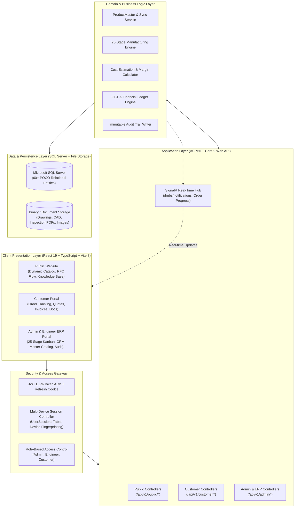
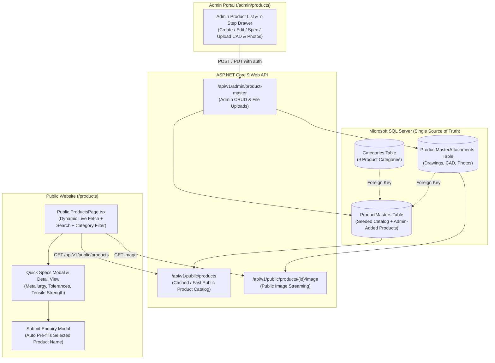
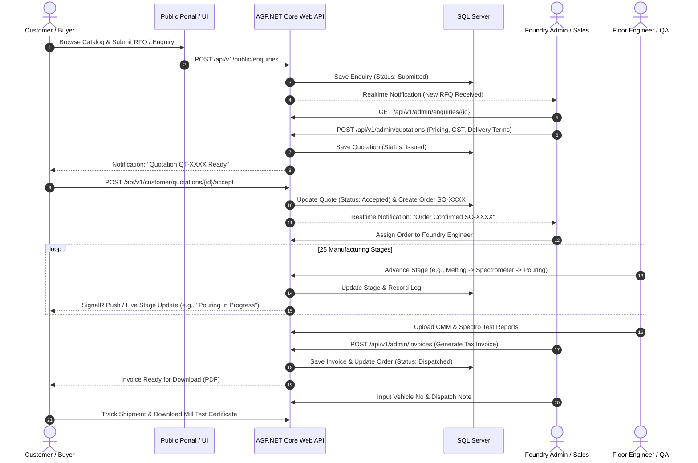
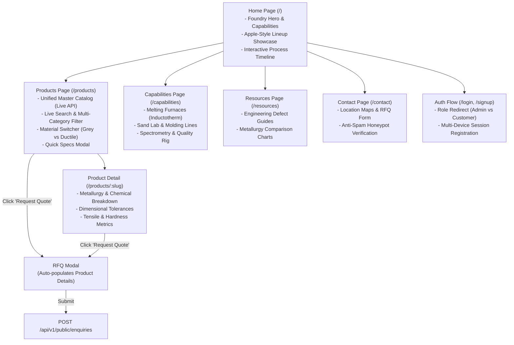
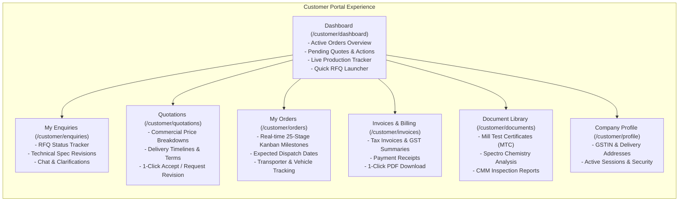
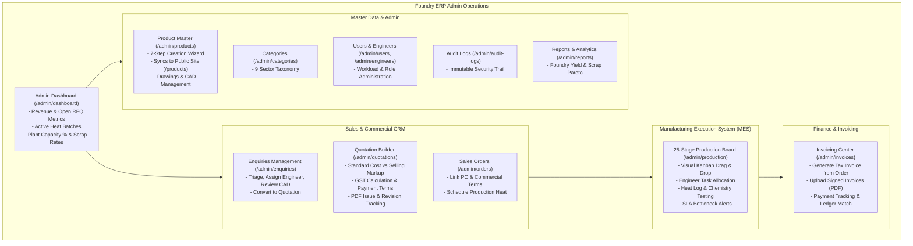
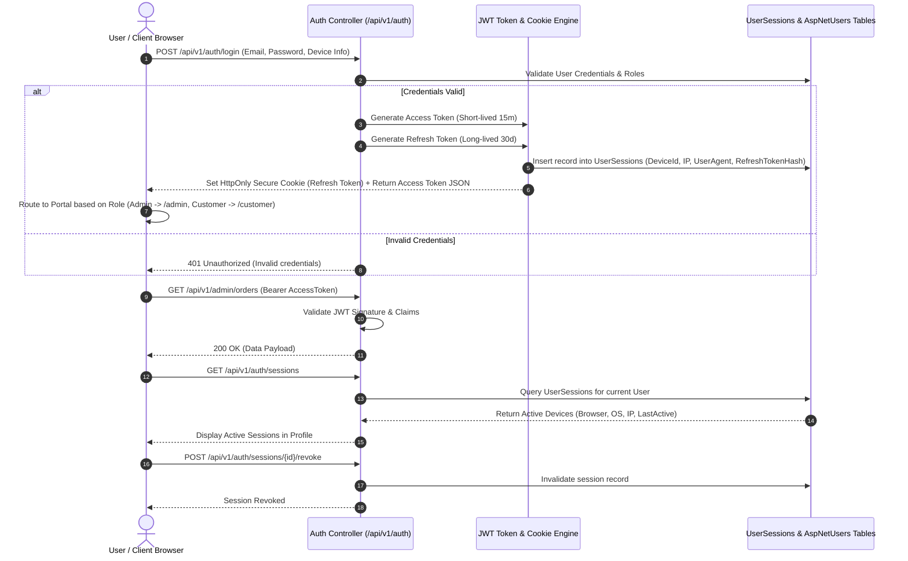

# Shakti Udyog — Complete Application Architecture & Interactive Flow Document

**Document Version:** 1.0.0  
**Target Platform:** ASP.NET Core 9 Web API (.NET 9) + React 19 / TypeScript / Vite 8 + Microsoft SQL Server  
**Classification:** Core System Architecture & Interactive Flow Specification  

---

## 1. Executive System Topology

Shakti Udyog is an end-to-end Foundry ERP and Customer Commerce Platform engineered for heavy-duty industrial casting operations (Grey Iron & Ductile Iron). The platform operates across three integrated planes:
1. **Public Marketing & Dynamic Product Showcase** (`/`, `/products`, `/capabilities`, `/resources`, `/contact`)
2. **Customer Self-Service Portal** (`/customer/*` — RFQs, Quotations, Orders, Invoices, Milestones, Documents)
3. **Internal ERP & Manufacturing Execution System (MES)** (`/admin/*` — CRM, Sales Pipeline, 25-Stage Production Kanban, Billing, Product Master Catalog, Multi-Device Security)

---

## 2. Product Master Catalog & Public Site Synchronization Architecture

All products displayed on the public website and managed within the admin portal share a **Single Source of Truth** in the `ProductMasters` relational database table.

### Unified Product Schema Matrix

| Field | Type | Description | Visibility / Usage |
| :--- | :--- | :--- | :--- |
| `Id` | `Guid` | Unique product identifier | Internal & Public API |
| `ProductCode` | `string` | Foundry Part/SKU (e.g. `PRD-SEW-001`) | Admin ERP & Quote Line Items |
| `ProductName` | `string` | Commercial & Engineering Name | Admin ERP, Public Catalog, Quotes |
| `CategoryId` | `Guid?` | Link to `Categories` (9 Core Sectors) | Admin Filter & Public Filter Tabs |
| `Material` | `string?` | `Grey Iron` / `Ductile Iron` | Metallurgy Filter & Material Badges |
| `MaterialGrade` | `string?` | `FG 200`, `FG 220`, `FG 260`, `SG 500/7`, `SG 600/3`, `SG 700/2` | Technical Specs Modal & ERP |
| `Standard` | `string?` | Standard specification (e.g. `IS 1865 / EN-GJS-500-7`) | Quality Compliance & Public Specs |
| `Weight` | `decimal?` | Unit weight in Kilograms (e.g. `0.65 kg`) | Shipping, Pricing, Public Card |
| `ImageUrl` | `string?` | Static image URL or uploaded attachment endpoint | Public Product Cards & Hero |
| `Application` | `string?` | Industrial use case (e.g. `Lockstitch machinery`) | Search Keyword & Public Detail |
| `Description` | `string?` | Engineering narrative & features | Technical Specs & Quotations |
| `Tolerance` | `string?` | Dimensional tolerance (e.g. `±0.015 mm CMM`) | Quality Standard & Specs Modal |
| `Hardness` | `string?` | Brinell Hardness (e.g. `170–230 HBW`) | Metallurgy Matrix & Inspection |
| `TensileStrength` | `string?` | Tensile rating (e.g. `500 MPa min`) | Engineering Data Sheet & Specs |
| `Status` | `string` | `Active` (Visible Publicly), `Draft`, `Archived` | Visibility & Lifecycle Control |

---

## 3. End-to-End Enterprise Flow (Inquiry to Delivery)

The lifecycle of an order spans customer inquiry, commercial negotiation, 25-stage casting production, quality certification, invoicing, and dispatch.

---

## 4. Complete Application Flow by Portal

### 4.1 Public Website Flow

---

### 4.2 Customer Portal Flow (`/customer/*`)

---

### 4.3 Admin ERP & Manufacturing Flow (`/admin/*`)

---

## 5. The 25-Stage Manufacturing Kanban State Machine

The foundry manufacturing process is structured into 6 critical operational phases comprising 25 discrete tracking stages:

```mermaid
stateDiagram-v2
    direction TB

    state "Phase 1: Pattern & Tooling" as Phase1 {
        [*] --> PatternInspection : P-01
        PatternInspection --> ToolingSetup : P-02
        ToolingSetup --> CoreBoxPreparation : P-03
        CoreBoxPreparation --> RiggingGating : P-04
    }

    state "Phase 2: Molding & Core Making" as Phase2 {
        RiggingGating --> SandPreparation : M-05
        SandPreparation --> CoreProduction : M-06
        CoreProduction --> MoldAssembly : M-07
        MoldAssembly --> MoldQualityInspection : M-08
    }

    state "Phase 3: Melting & Pouring" as Phase3 {
        MoldQualityInspection --> ChargeCalculation : C-09
        ChargeCalculation --> InductionMelting : C-10
        InductionMelting --> SpectrometerAnalysis : C-11 (Chemistry Sign-off)
        SpectrometerAnalysis --> InoculationTreatment : C-12 (Ductile/SG Node)
        InoculationTreatment --> LadlePouring : C-13
    }

    state "Phase 4: Cooling & Shakeout" as Phase4 {
        LadlePouring --> ControlledCooling : S-14
        ControlledCooling --> ShakeoutVibration : S-15
        ShakeoutVibration --> DegatingRunnerRemoval : S-16
    }

    state "Phase 5: Fettling & Heat Treatment" as Phase5 {
        DegatingRunnerRemoval --> ShotBlasting : F-17
        ShotBlasting --> GrindingFinishing : F-18
        GrindingFinishing --> HeatTreatmentAnnealing : F-19 (Stress Relief)
    }

    state "Phase 6: Machining, QA & Dispatch" as Phase6 {
        HeatTreatmentAnnealing --> CNCMachining : Q-20
        CNCMachining --> CMMInspection : Q-21 (Dimensional Sign-off)
        CMMInspection --> HydrostaticTesting : Q-22 (Pressure Test)
        HydrostaticTesting --> SurfacePaintingOiling : Q-23
        SurfacePaintingOiling --> PackagingBarcoding : Q-24
        PackagingBarcoding --> DispatchGatePass : Q-25
        DispatchGatePass --> [*]
    }
```

---

## 6. Authentication, Multi-Device Sessions & Security Flow

---

## 7. Complete API Endpoint Directory

### 7.1 Public API (`/api/v1/public/*`)
- `GET /api/v1/public/products` — Retrieve all active products with full specifications, categories, and image URLs.
- `GET /api/v1/public/products/{id}` — Retrieve single product detail.
- `GET /api/v1/public/products/{id}/image` — Stream public primary image or attachment.
- `GET /api/v1/public/categories` — List active product categories.
- `POST /api/v1/public/enquiries` — Submit new RFQ / quotation inquiry (with anti-spam honeypot).
- `POST /api/v1/public/contact-requests` — Submit general contact request.
- `GET /api/v1/public/resources` — Retrieve technical engineering articles & defect guides.

### 7.2 Authentication API (`/api/v1/auth/*`)
- `POST /api/v1/auth/login` — Authenticate user, issue access token & set refresh cookie.
- `POST /api/v1/auth/register` — Customer account self-registration.
- `POST /api/v1/auth/refresh-token` — Rotate refresh token & issue new access token.
- `POST /api/v1/auth/logout` — Revoke active session & clear cookie.
- `GET /api/v1/auth/sessions` — List all active login sessions for user.
- `POST /api/v1/auth/sessions/{id}/revoke` — Terminate specific remote session.

### 7.3 Admin ERP API (`/api/v1/admin/*`)
- `GET/POST /api/v1/admin/product-master` — Product Master ERP catalog CRUD.
- `POST /api/v1/admin/product-master/{id}/attachments` — Upload technical drawings/CAD/photos.
- `GET/POST /api/v1/admin/enquiries` — Manage customer RFQs, assign engineers, update status.
- `GET/POST /api/v1/admin/quotations` — Issue commercial quotations, manage pricing & GST.
- `GET/POST /api/v1/admin/orders` — Manage sales orders, milestone tracking, overrides.
- `GET/POST /api/v1/admin/invoices` — Tax invoice generation, payment tracking, PDF export.
- `GET /api/v1/admin/audit-logs` — Immutable system audit log inspection.
- `GET /api/v1/admin/reports` — Production throughput, scrap rate Pareto, foundry yield metrics.

### 7.4 Customer Portal API (`/api/v1/customer/*`)
- `GET /api/v1/customer/dashboard` — Live dashboard summary.
- `GET /api/v1/customer/enquiries` — Customer's submitted RFQs.
- `GET /api/v1/customer/quotations` — Issued quotations with 1-click acceptance.
- `GET /api/v1/customer/orders` — Active orders and 25-stage manufacturing progress.
- `GET /api/v1/customer/invoices` — Billing history, outstanding balance & PDF downloads.
- `GET /api/v1/customer/documents` — Inspection certificates, MTCs, and CAD drawings.

---

## 8. Summary of Architectural Guarantees

1. **Zero Data Fragmentation:** Product master data is maintained exclusively in `ProductMasters`, eliminating hardcoded client lists and ensuring instant synchronization between Admin ERP and Public marketing.
2. **Deterministic Manufacturing State:** Every order strictly adheres to the 25-stage foundry workflow with real-time audit logging and SignalR push updates.
3. **Enterprise Security & Isolation:** Multi-device session tracking, HttpOnly secure cookies, and strict Role-Based Access Control (Admin, Engineer, Customer) protect all operational, financial, and CAD assets.
